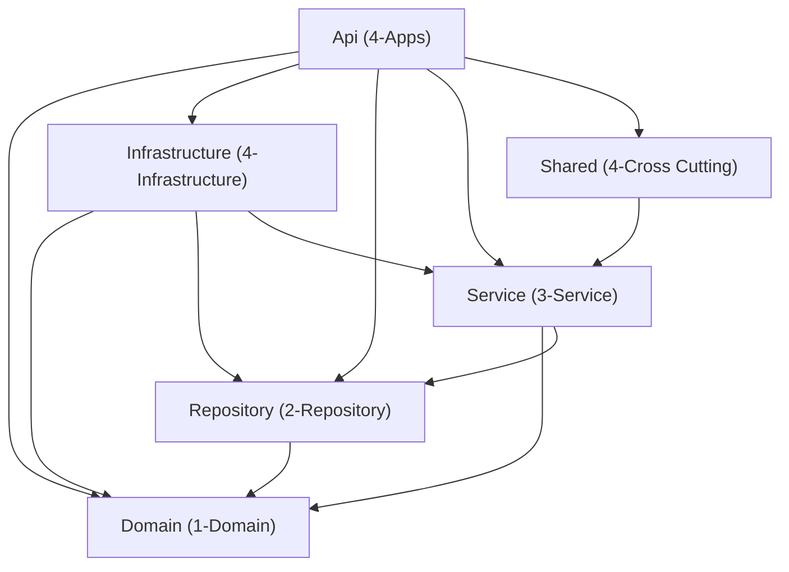

# Complete Technical Guide — Unity Exchange Rates API

## Table of Contents

1. [Project Overview](#1-project-overview)
2. [Technology Stack](#2-technology-stack)
3. [Solution Architecture](#3-solution-architecture)
4. [Domain Layer](#4-domain-layer---unityexchangeratesdomain)
5. [Repository Layer](#5-repository-layer---unityexchangeratesrepository)
6. [Service Layer](#6-service-layer---unityexchangeratesservice)
7. [Infrastructure Layer](#7-infrastructure-layer---unityexchangeratesinfrastructure)
8. [Shared Layer](#8-shared-layer---unityexchangeratesshared)
9. [Api Layer](#9-api-layer---unityexchangeratesapi)
10. [Configuration & Settings](#10-configuration--settings)
11. [Dependency Injection Flow](#11-dependency-injection-flow)
12. [Database Schema](#12-database-schema)
13. [Logging Strategy](#13-logging-strategy)
14. [Background Jobs (Hangfire)](#14-background-jobs-hangfire)
15. [Key Design Decisions](#15-key-design-decisions)

---

## 1. Project Overview

### What Does This API Do?

This API fetches daily exchange rates from **Bank Negara Malaysia (BNM)** and stores them in a local SQL Server database for historical tracking and querying.

**Key Features:**

- **GET** exchange rate by currency and date (proxies to BNM API)
- **POST** manual sync — fetch and store rates for all active currencies on a given date
- **Automated daily sync** at midnight using Hangfire
- **Resilient HTTP calls** with Polly retry policy (1s → 2s → 5s backoff)
- **Structured logging** with Serilog (file sink, rolling daily, 30-day retention)
- **Input validation** via FluentValidation pipeline behavior
- **Standardised responses** via FluentResults + BaseResult/BaseResponse

---

## 2. Technology Stack

| Category | Technology | Version |
|---|---|---|
| Framework | ASP.NET Core (Minimal Hosting) | .NET 9.0 |
| CQRS / Mediator | Mediator (source generator) | 3.0.1 |
| Object Mapping | AutoMapper | 13.0.1 |
| Validation | FluentValidation | 11.9.2 |
| Result Pattern | FluentResults | 4.0.0 |
| ORM | Entity Framework Core (SQL Server) | 9.0.2 |
| Background Jobs | Hangfire (SQL Server storage) | 1.8.16 |
| Resilience | Polly | 8.6.3 |
| Logging | Serilog (File sink) | 9.0.0 |
| API Documentation | Swashbuckle / Swagger | 10.1.0 |
| JSON | Newtonsoft.Json + System.Text.Json | 13.0.3 / built-in |

---

## 3. Solution Architecture

### 6-Project Layered Structure

```
Unity.ExchangeRates.svc.slnx
├── /1-Domain/      → Unity.ExchangeRates.Domain
├── /2-Repository/  → Unity.ExchangeRates.Repository
├── /3-Service/     → Unity.ExchangeRates.Service
├── /4-Apps/        → Unity.ExchangeRates.Api
├── /4-Infrastructure/ → Unity.ExchangeRates.Infrastructure
└── /4-Cross Cutting/  → Unity.ExchangeRates.Shared
```

### Dependency Graph



---

## 4. Domain Layer — `Unity.ExchangeRates.Domain`

> **Purpose:** Pure data models and domain exceptions. No logic, no infrastructure dependencies.

### 4.1 `BaseEntity<TId>` — Abstract Base Entity

**File:** `Models/BaseEntity.cs`

```csharp
public abstract class BaseEntity<TId>
{
    [Key]
    public virtual required TId Id { get; set; }
    public DateTime CreatedOn { get; set; }
    public string? CreatedBy { get; set; }
    public DateTime? ModifiedOn { get; set; }
    public string? ModifiedBy { get; set; }
}
```

**Purpose:** All database entities inherit from this. Provides:
- **`Id`** — generic primary key (allows `int`, `string`, or any type)
- **Audit fields** — `CreatedOn`, `CreatedBy`, `ModifiedOn`, `ModifiedBy` (auto-stamped by `EntitySaveChangeInterceptor`)

---

### 4.2 `Currency` — Currency Entity

**File:** `Models/Currency.cs`

```csharp
[Table("Currency")]
public class Currency : BaseEntity<string>
{
    [Key, Column("CurrencyCode"), StringLength(10)]
    public override required string Id { get; set; }

    [NotMapped]
    public string CurrencyCode { get => Id; set => Id = value; }

    [Required, StringLength(100)]
    public required string CurrencyName { get; set; }

    public int UnitBase { get; set; }
}
```

**Purpose:** Represents a currency tracked by the system (e.g., USD, GBP, EUR).

| Property | Type | Description |
|---|---|---|
| `Id` / `CurrencyCode` | `string` | ISO currency code (e.g. "USD"). PK, max 10 chars |
| `CurrencyName` | `string` | Full name (e.g. "US Dollar"). Required, max 100 chars |
| `UnitBase` | `int` | Base units for the exchange rate |

**Note:** `CurrencyCode` is a `[NotMapped]` convenience alias for `Id`.

---

### 4.3 `ExchangeRateHistory` — Rate History Entity

**File:** `Models/ExchangeRateHistory.cs`

```csharp
[Table("ExchangeRateHistory")]
public class ExchangeRateHistory : BaseEntity<int>
{
    [Required, StringLength(10)]
    public required string CurrencyCode { get; set; }
    public DateTime RateDate { get; set; }
    [Column(TypeName = "decimal(18, 4)")]
    public decimal? BuyingRate { get; set; }
    [Column(TypeName = "decimal(18, 4)")]
    public decimal? SellingRate { get; set; }
    [Column(TypeName = "decimal(18, 4)")]
    public decimal? MiddleRate { get; set; }
    public DateTime EffectiveDate { get; set; }
    [ForeignKey(nameof(CurrencyCode))]
    public Currency? Currency { get; set; }
}
```

**Purpose:** One row per currency per date. Stores BNM's buying, selling, and middle rates.

| Property | Type | Description |
|---|---|---|
| `Id` | `int` | Auto-increment PK |
| `CurrencyCode` | `string` | FK to Currency table |
| `RateDate` | `DateTime` | The date this rate applies to |
| `BuyingRate` | `decimal?` | BNM buying rate (precision 18,4) |
| `SellingRate` | `decimal?` | BNM selling rate |
| `MiddleRate` | `decimal?` | BNM middle rate |
| `EffectiveDate` | `DateTime` | When this rate became effective |
| `Currency` | `Currency?` | Navigation property |

---

### 4.4 `BnmApiResponse` — BNM API DTOs

**File:** `Models/BnmApiResponse.cs`

Models for deserialising BNM's JSON response. Uses `System.Text.Json` `[JsonPropertyName]` attributes.

| Class | Properties | Purpose |
|---|---|---|
| `BnmApiResponse` | `Data` (`BnmRateData`), `Meta` (`BnmMeta`) | Top-level response envelope |
| `BnmRateData` | `CurrencyCode`, `Unit`, `Rate` (`RateDetails`) | Currency data with rate details |
| `RateDetails` | `Date`, `BuyingRate`, `SellingRate`, `MiddleRate` | The actual exchange rate numbers |
| `BnmMeta` | `Quote`, `Session`, `LastUpdated`, `TotalResult` | Metadata about the API response |

---

### 4.5 `ExchangeRatesDomainException` — Custom Domain Exception

**File:** `Exceptions/ExchangeRatesDomainException.cs`

```csharp
[Serializable]
public class ExchangeRatesDomainException : Exception
{
    public string Code { get; private set; } = string.Empty;
    // Constructors: (), (message), (code, message), (message, inner), (code, message, inner)
}
```

**Purpose:** Custom exception for domain-specific errors. The `Code` property carries a business error code. Caught by `ExceptionHandlerMiddleware` → returns HTTP 400.

---

## 5. Repository Layer — `Unity.ExchangeRates.Repository`

> **Purpose:** Defines **interfaces only** — no implementations. This is the contract layer.

### 5.1 `IExchangeRateRepository` — Repository Contract

**File:** `IExchangeRateRepository.cs`

```csharp
public interface IExchangeRateRepository
{
    Task<List<Currency>> GetActiveCurrenciesAsync(CancellationToken cancellationToken);
    Task AddRateHistoryAsync(ExchangeRateHistory history, CancellationToken cancellationToken);
    Task<int> SaveChangesAsync(CancellationToken cancellationToken);
}
```

| Method | Purpose |
|---|---|
| `GetActiveCurrenciesAsync` | Returns all currencies from the `Currency` table |
| `AddRateHistoryAsync` | Adds one `ExchangeRateHistory` entity to the change tracker |
| `SaveChangesAsync` | Persists all pending changes to the database; returns count of affected rows |

**Why a separate project?** The Service layer depends on this interface. The Infrastructure layer provides the implementation. This keeps the Service layer free of EF Core dependencies.

---

## 6. Service Layer — `Unity.ExchangeRates.Service`

> **Purpose:** All business logic via CQRS pattern — command/query definitions, handlers, validators, pipeline behaviors, error types, result models, and configuration options.

### 6.1 CQRS: Queries

#### `ExchangeRateQuery`

**File:** `Mediator/Queries/ExchangeRates/ExchangeRateQuery.cs`

```csharp
public class ExchangeRateQuery : IRequest<Result<BaseResult>>
{
    public string? appId { get; set; }
    public string? currency { get; set; }
    public string? date { get; set; }
}
```

A Mediator request to fetch a single exchange rate from BNM for a given currency and date.

#### `ExchangeRateQueryHandler`

**File:** `Mediator/Queries/ExchangeRates/ExchangeRateQueryHandler.cs`

**Dependencies:** `IHttpClientFactory` (named "BnmClient"), `IOptions<BnmApiOptions>`, `ILogger<ExchangeRateQueryHandler>`

**Method: `Handle(ExchangeRateQuery request, CancellationToken ct)`**

1. Builds BNM API URL: `{endpoint}/{currency}/date/{date}?session=1700&quote=rm`
2. Calls `_httpClient.GetAsync(url, ct)` — the HttpClient has Polly retry policy attached
3. If non-success HTTP status → returns `Result.Fail(new GeneralError { errorCode = "00400" })`
4. Deserialises response as `BnmApiResponse` using `ReadFromJsonAsync<BnmApiResponse>()`
5. If null → returns `Result.Fail(new NotFoundError { errorCode = "00404" })`
6. If success → returns `new BaseResult { appId, data = bnmData.Data }`
7. Any exception → catches, logs, returns `Result.Fail(new GeneralError { errorCode = "00500" })`

#### `ExchangeRateQueryValidator`

**File:** `Mediator/Queries/ExchangeRates/ExchangeRateQueryValidator.cs`

```csharp
public sealed class ExchangeRateQueryValidator : AbstractValidator<ExchangeRateQuery>
{
    public ExchangeRateQueryValidator()
    {
        RuleFor(c => c.currency).NotEmpty().WithErrorCode("00400").WithMessage("Currency is required.");
        RuleFor(c => c.date).NotEmpty().WithErrorCode("00400").WithMessage("Date is required.")
            .Matches(@"^\d{4}-\d{2}-\d{2}$").WithErrorCode("00400").WithMessage("Date must be in yyyy-MM-dd format.");
    }
}
```

Runs automatically via `RequestValidationBehavior` pipeline before the handler.

---

### 6.2 CQRS: Commands

#### `ExchangeRateSyncCommand`

**File:** `Mediator/Commands/ExchangeRates/ExchangeRateSyncCommand.cs`

```csharp
public class ExchangeRateSyncCommand : IRequest<Result<BaseResult>>
{
    public string? appId { get; set; }
    public string? date { get; set; }
}
```

A Mediator request to sync all active currencies for a given date.

#### `ExchangeRateSyncCommandHandler`

**File:** `Mediator/Commands/ExchangeRates/ExchangeRateSyncCommandHandler.cs`

**Dependencies:** `IExchangeRateRepository`, `ISender` (Mediator), `ILogger<ExchangeRateSyncCommandHandler>`

**Method: `Handle(ExchangeRateSyncCommand request, CancellationToken ct)`**

1. Calls `_repository.GetActiveCurrenciesAsync(ct)` — loads all currencies
2. For each currency:
   a. Creates `ExchangeRateQuery { appId, currency = curr.Id, date }`
   b. Calls `_mediator.Send(query, ct)` — **reuses the query handler** for BNM API call
   c. If success and `result.ValueOrDefault.data` is `BnmRateData`:
      - Creates `ExchangeRateHistory` entity with rates, dates, `CreatedBy = "System_Mediator"`
      - Calls `_repository.AddRateHistoryAsync(history, ct)`
      - Increments `syncedCount`
   d. If failed → logs warning with error details, skips this currency
3. Calls `_repository.SaveChangesAsync(ct)` — bulk persists all added histories
4. Returns `BaseResult { data = "Synced {syncedCount} of {total} currencies for {date}" }`
5. Any exception → catches, logs, returns `Result.Fail(new GeneralError { errorCode = "00500" })`

#### `ExchangeRateSyncCommandValidator`

**File:** `Mediator/Commands/ExchangeRates/ExchangeRateSyncCommandValidator.cs`

Validates: `date` not empty + matches `yyyy-MM-dd` format.

---

### 6.3 Pipeline Behavior

#### `RequestValidationBehavior<TRequest, TResponse>`

**File:** `Behaviors/RequestValidationBehavior.cs`

```csharp
public class RequestValidationBehavior<TRequest, TResponse> : IPipelineBehavior<TRequest, TResponse>
    where TRequest : IRequest<TResponse>
    where TResponse : ResultBase<TResponse>, new()
```

**How it works:**

1. Receives `IEnumerable<IValidator<TRequest>>` — all registered validators for this request type
2. Creates a `ValidationContext<TRequest>` and runs all validators in parallel
3. Collects failures
4. If any failures:
   - Creates `ValidationError` for each failure, extracting `appId` via reflection from the request
   - Returns a failed `TResponse` with the validation errors (handler is **never called**)
5. If no failures:
   - Calls `next(message, ct)` — proceeds to the actual handler

**Registration:** `services.AddTransient(typeof(IPipelineBehavior<,>), typeof(RequestValidationBehavior<,>))`

---

### 6.4 Error Types

All implement `IError` from FluentResults and carry a standardised error shape:

| Class | File | Default Message | Used For |
|---|---|---|---|
| `GeneralError` | `Common/Errors/GeneralError.cs` | "An error has occurred." | BNM API failures, unexpected errors |
| `NotFoundError` | `Common/Errors/NotFoundError.cs` | "No record or record not found." | BNM returns null/empty |
| `ValidationError` | `Common/Errors/ValidationError.cs` | "One or more validation errors occurred." | FluentValidation failures |

**Common properties on all error types:**

| Property | Type | Description |
|---|---|---|
| `appId` | `string` | Application identifier from the request |
| `status` | `string` | Always `"Failed"` (from `CommonConstants.StandardFormat.FailedStatus`) |
| `timestamp` | `string` | ISO-8601 formatted current time |
| `traceId` | `string` | `Activity.Current?.Id` for distributed tracing |
| `errorCode` | `string` | 5-digit code (e.g. "00400", "00404", "00500") |
| `errorMsg` | `string` | Human-readable error message |
| `data` | `object?` | Optional additional data |

---

### 6.5 Result Model

#### `BaseResult`

**File:** `Models/Results/BaseResult.cs`

```csharp
public class BaseResult
{
    public string appId { get; set; }
    public string status { get; set; } = "Success";
    public string timestamp { get; set; } = DateTime.Now.ToString("yyyy-MM-ddTHH\\:mm\\:ss.fffzzz", CultureInfo.InvariantCulture);
    public string traceId { get; set; } = Activity.Current?.Id;
    public string? errorCode { get; set; }
    public string? errorMsg { get; set; }
    public object? data { get; set; }
}
```

**Purpose:** Standard success response shape. Wrapped in `Result<BaseResult>` from FluentResults. The `data` property holds the actual payload (e.g. `BnmRateData` for queries, summary string for commands).

---

### 6.6 Constants

#### `CommonConstants`

**File:** `Models/Constants/CommonConstants.cs`

```csharp
public struct StandardFormat
{
    public static CultureInfo Culture = new CultureInfo("en-MY", false);
    public const string DateTime = "{0:dd/MM/yyyy}";
    public const string ISODateTime = "yyyy-MM-dd";
    public const string HashDateTime = "yyyyMMdd";
    public const string FailedStatus = "Failed";
}

public class ResponseMessage
{
    public const string GENERAL_ERROR = "An error has occurred.";
    public const string VALIDATOR_ERROR = "One or more validation errors occurred.";
    public const string NOTFOUND_ERROR = "No record or record not found.";
    public const string DUPLICATED_ERROR = "Record already exists.";
}
```

---

### 6.7 Configuration

#### `BnmApiOptions`

**File:** `Configurations/BnmApiOptions.cs`

```csharp
public class BnmApiOptions
{
    public string BaseUrl { get; set; } = string.Empty;
    public string AcceptHeader { get; set; } = "application/vnd.BNM.API.v1+json";
    public Dictionary<string, string> Endpoints { get; set; } = new();
}
```

Bound from `appsettings.json` section `"BnmApiSettings"`.

#### `ErrorCodes`

**File:** `Common/Configuration/ErrorCodes.cs`

Configuration model for error code dictionaries: `DataValidations`, `LogicValidations`, `IntegrationValidations`, `SystemValidations`.

---

### 6.8 Service DI Registration

**File:** `ServiceCollectionExtensions.cs`

**Method: `RegisterServiceModule(IServiceCollection, IConfiguration)`**

1. **`AddService()`:**
   - Sets FluentValidation cascade mode to `Stop` (first failure stops validation)
   - Registers `RequestValidationBehavior` as `IPipelineBehavior<,>`
   - Auto-registers all validators from the assembly
2. **`AddAppSettings()`:**
   - Binds `BnmApiOptions` from configuration section `"BnmApiSettings"`

---

## 7. Infrastructure Layer — `Unity.ExchangeRates.Infrastructure`

> **Purpose:** Implements data access using EF Core. Owns the database context, migrations, interceptors, and repository implementations.

### 7.1 `AppDbContext` — Database Context

**File:** `Data/AppDbContext.cs`

```csharp
public class AppDbContext : DbContext
{
    private readonly EntitySaveChangeInterceptor _interceptor;

    public DbSet<Currency> Currencies { get; set; } = null!;
    public DbSet<ExchangeRateHistory> ExchangeRateHistories { get; set; } = null!;
}
```

**`OnModelCreating` — Fluent API configuration:**

| Entity | Configuration |
|---|---|
| `Currency` | PK on `Id` (column `CurrencyCode`, max 10), `CurrencyName` max 100, table `Currency` |
| `ExchangeRateHistory` | PK on `Id`, `RateDate` default `GETDATE()`, rates as `decimal(18,4)`, table `ExchangeRateHistory` |

---

### 7.2 `EntitySaveChangeInterceptor` — Audit Field Interceptor

**File:** `Interceptors/EntitySaveChangeInterceptor.cs`

```csharp
public class EntitySaveChangeInterceptor : SaveChangesInterceptor
```

Intercepts both `SavingChanges` (sync) and `SavingChangesAsync` (async).

**Method: `UpdateEntities(DbContext? context)`**

Iterates all tracked entities of type `BaseEntity<int>` and `BaseEntity<string>`:
- **Added:** Sets `CreatedOn = DateTime.Now`
- **Added or Modified:** Sets `ModifiedOn = DateTime.Now`

This ensures audit timestamps are always consistent without handlers needing to set them manually.

---

### 7.3 `ExchangeRateRepository` — Repository Implementation

**File:** `Repositories/ExchangeRateRepository.cs`

Implements `IExchangeRateRepository` using `AppDbContext`.

| Method | Implementation | Logging |
|---|---|---|
| `GetActiveCurrenciesAsync` | `_context.Currencies.ToListAsync(ct)` | Debug: "called", Info: "returned {Count} currencies" |
| `AddRateHistoryAsync` | `_context.ExchangeRateHistories.AddAsync(history, ct)` | Debug: "for CurrencyCode={}, RateDate={}" |
| `SaveChangesAsync` | `_context.SaveChangesAsync(ct)` | Debug: "called", Info: "persisted {Count} changes" |

---

### 7.4 Infrastructure DI Registration

**File:** `ServiceCollectionExtensions.cs`

**Method: `RegisterInfrastructureModule(IServiceCollection, IConfiguration)`**

1. **`AddContext()`:**
   - Gets `DefaultConnection` connection string
   - Registers `AppDbContext` with SQL Server provider (600s command timeout)
   - Registers `EntitySaveChangeInterceptor` as scoped
2. **`AddPersistence()`:**
   - Registers `IExchangeRateRepository → ExchangeRateRepository` as scoped

---

## 8. Shared Layer — `Unity.ExchangeRates.Shared`

> **Purpose:** Cross-cutting concerns — Hangfire background jobs and HttpClient configuration.

### 8.1 `IExchangeRateSyncJob` — Job Interface

**File:** `Jobs/IExchangeRateSyncJob.cs`

```csharp
public interface IExchangeRateSyncJob
{
    Task SyncDailyAsync(CancellationToken cancellationToken = default);
}
```

### 8.2 `ExchangeRateSyncJob` — Job Implementation

**File:** `Jobs/ExchangeRateSyncJob.cs`

**Dependencies:** `ISender` (Mediator), `ILogger<ExchangeRateSyncJob>`

**Method: `SyncDailyAsync(CancellationToken ct)`**

1. Calculates target date via `GetPreviousBusinessDate(DateTime.Now)`:
   - Subtracts 1 day from today
   - If Saturday or Sunday, keeps subtracting until reaching a weekday
   - (Monday at midnight → syncs Friday's rates)
2. Creates `ExchangeRateSyncCommand { date = targetDate }`
3. Calls `_mediator.Send(command, ct)`
4. Logs success or failure

---

### 8.3 Shared DI Registration

**File:** `ServiceCollectionExtensions.cs`

**Method: `RegisterSharedServiceModule(IServiceCollection, IConfiguration)`**

1. **`AddHttpClients()`:**
   - Registers named HttpClient `"BnmClient"`:
     - Base address from `BnmApiOptions.BaseUrl`
     - Accept header from `BnmApiOptions.AcceptHeader` (`"application/vnd.BNM.API.v1+json"`)
     - 10-second timeout
   - Adds Polly retry policy via `AddPolicyHandler(BuildRetryPolicy())`:
     - Handles transient HTTP errors (5xx, network failures)
     - Retries 3 times with delays: 1s → 2s → 5s
2. **`AddHangfireServices()`:**
   - Configures Hangfire with SQL Server storage (same connection string)
   - Adds Hangfire server
   - Registers `IExchangeRateSyncJob → ExchangeRateSyncJob` as scoped

---

## 9. Api Layer — `Unity.ExchangeRates.Api`

> **Purpose:** ASP.NET Core host. Controllers, middleware, ViewModels, mapping, configuration, Program.cs bootstrap.

### 9.1 `Program.cs` — Application Bootstrap

**File:** `Program.cs` (120 lines)

#### Startup Sequence:

1. **Serilog bootstrap:** `Log.Logger = new LoggerConfiguration().ReadFrom.Configuration(...).CreateLogger()`
2. **Layer DI registration:**
   - `RegisterServiceModule()` — validators, pipeline behavior, BnmApiOptions
   - `RegisterInfrastructureModule()` — EF Core, repositories
   - `RegisterSharedServiceModule()` — Hangfire, HttpClient + Polly
3. **Mediator:** `AddMediator(opt => opt.ServiceLifetime = ServiceLifetime.Scoped)` — source-gen registration
4. **AutoMapper:** `AddAutoMapper(typeof(Program).Assembly)` — scans for profiles in Api project
5. **CORS:** `ConfigureCors()` — reads `CorsOptions` from config or falls back to allow-all in Development
6. **Controllers + Swagger:** `AddControllers()`, `AddSwaggerGen()`

#### Middleware Pipeline:

1. `ExceptionHandlerMiddleware` — global exception catching
2. Swagger UI (Development only)
3. `UseHttpsRedirection()`
4. `UseCors()`
5. `UseHangfireDashboard()` — dashboard at `/hangfire`
6. `UseAuthorization()`
7. `MapControllers()`

#### Hangfire Recurring Job:

```csharp
RecurringJob.AddOrUpdate<IExchangeRateSyncJob>(
    "daily-exchange-rate-sync",
    job => job.SyncDailyAsync(CancellationToken.None),
    "0 0 * * *",  // Daily at midnight
    new RecurringJobOptions { TimeZone = TimeZoneInfo.Local });
```

#### Graceful Shutdown:

```csharp
try { app.Run(); }
catch (Exception ex) { Log.Fatal(ex, "Application terminated unexpectedly"); }
finally { Log.CloseAndFlush(); }
```

---

### 9.2 `BaseApiController` — Base Controller

**File:** `Controllers/Base/BaseApiController.cs`

All controllers inherit from `BaseApiController : ControllerBase`.

**Key Methods:**

| Method | Signature | Purpose |
|---|---|---|
| `ApiResponse<T>` | `(Result<T> result)` → `IActionResult` | Maps a single FluentResult to HTTP response |
| `ApiResponse<T, T2>` | `(Result<T> responseResult, Result<T2> result)` → `IActionResult` | Maps a response ViewModel result alongside the raw result (used when AutoMapper maps BaseResult → BaseResponse) |
| `UnhandledProblem` | `()` → `IActionResult` | Returns 500 with `BaseResponse` for unhandled exceptions |

**Error Mapping Logic (`HandleFluentResultProblem`):**

| Error Type | HTTP Status |
|---|---|
| `GeneralError` | 400 Bad Request |
| `NotFoundError` | 404 Not Found |
| `ValidationError` | 400 Bad Request |
| Other / null | 500 Internal Server Error |

The method deserialises the `IError` to `BaseResponse` via Newtonsoft.Json to convert error properties into the standard response shape.

---

### 9.3 `ExchangeRateController` — API Endpoints

**File:** `Controllers/ExchangeRateController.cs`

**Route:** `api/exchangerates`

**Dependencies:** `IMapper` (AutoMapper), `ISender` (Mediator), `ILogger<ExchangeRateController>`

#### `GET {currency}/{date}` — Get Exchange Rate

```csharp
[HttpGet("{currency}/{date}")]
public async Task<IActionResult> GetRate(string currency, string date, [FromQuery] string appId = "")
```

1. Creates `ExchangeRateRequest { appId, currency, date }`
2. Maps to `ExchangeRateQuery` via AutoMapper
3. Sends via `_mediator.Send(query)`
4. Maps `BaseResult` → `BaseResponse` via AutoMapper
5. Returns `ApiResponse<BaseResponse, BaseResult>(mappedResponse, result)`

**Responses:** 200 OK, 400 Bad Request, 404 Not Found

#### `POST sync` — Sync Exchange Rates

```csharp
[HttpPost("sync")]
public async Task<IActionResult> Sync([FromBody] ExchangeRateSyncRequest syncRequest)
```

1. Maps `ExchangeRateSyncRequest` → `ExchangeRateSyncCommand` via AutoMapper
2. Sends via `_mediator.Send(command)`
3. Maps result → response
4. Returns `ApiResponse<BaseResponse, BaseResult>(...)`

**Responses:** 200 OK, 400 Bad Request, 500 Internal Server Error

---

### 9.4 `ExceptionHandlerMiddleware` — Global Error Handler

**File:** `Middlewares/ExceptionHandlerMiddleware.cs`

Wraps the entire request pipeline in a try/catch.

| Exception Type | HTTP Status | Response |
|---|---|---|
| `ExchangeRatesDomainException` | 400 | `{ "message": "..." }` |
| `ValidationException` (FluentValidation) | 400 | First distinct error message |
| Any other | 500 | `{ "message": "..." }` |

All exceptions are logged via `_logger.LogError(error, error?.Message)`.

---

### 9.5 ViewModels

#### Request ViewModels

| Class | File | Properties |
|---|---|---|
| `ExchangeRateRequest` | `ViewModels/Request/ExchangeRateRequest.cs` | `appId`, `currency`, `date` |
| `ExchangeRateSyncRequest` | `ViewModels/Request/ExchangeRateSyncRequest.cs` | `appId`, `date` |

Both marked with `[ValidateNever]` — validation is handled by FluentValidation in the pipeline, not by model binding.

#### Response ViewModel

| Class | File | Properties |
|---|---|---|
| `BaseResponse` | `ViewModels/Response/BaseResponse.cs` | `appId`, `status`, `timestamp`, `traceId`, `errorCode`, `errorMsg`, `data` |

Mirrors `BaseResult` in shape but lives in the Api layer.

---

### 9.6 `InitialMapper` — AutoMapper Profile

**File:** `Configurations/InitialMapper.cs`

```csharp
internal class InitialMapper : Profile
{
    public InitialMapper()
    {
        CreateMap<ExchangeRateRequest, ExchangeRateQuery>();        // Request VM → Query
        CreateMap<ExchangeRateSyncRequest, ExchangeRateSyncCommand>(); // Request VM → Command
        CreateMap<BaseResult, BaseResponse>();                       // Result → Response VM
    }
}
```

**Purpose:** Separates the Api layer's ViewModels from the Service layer's CQRS objects. Controllers use AutoMapper instead of manual property mapping.

---

### 9.7 `CorsOptions`

**File:** `Configurations/CorsOptions.cs`

```csharp
public class CorsOptions
{
    public string[] Origins { get; set; }
}
```

Bound from `appsettings.json` section `"CorsOptions"`. If missing in Development → allows all origins. If missing in Production → throws `InvalidOperationException`.

---

## 10. Configuration & Settings

### `appsettings.json` (shared)

```json
{
  "Serilog": {
    "MinimumLevel": { "Default": "Debug", "Override": { "Microsoft": "Information", "Microsoft.AspNetCore": "Warning" } },
    "WriteTo": [{
      "Name": "File",
      "Args": {
        "path": "Logs/exchange-rates-.log",
        "rollingInterval": "Day",
        "retainedFileCountLimit": 30,
        "outputTemplate": "{Timestamp:yyyy-MM-dd HH:mm:ss.fff zzz} [{Level:u3}] {SourceContext}: {Message:lj}{NewLine}{Exception}"
      }
    }]
  }
}
```

### `appsettings.Development.json` (Development-only)

```json
{
  "ConnectionStrings": { "DefaultConnection": "Server=(localdb)\\MSSQLLocalDB;Database=UnityExchangeRatesDb;..." },
  "BnmApiSettings": {
    "BaseUrl": "https://api.bnm.gov.my/",
    "Endpoints": { "ExchangeRate": "public/exchange-rate" },
    "AcceptHeader": "application/vnd.BNM.API.v1+json"
  }
}
```

---

## 11. Dependency Injection Flow

```
Program.cs
│
├── RegisterServiceModule(config)              ─→ Service project
│   ├── AddValidatorsFromAssembly()            ─→ ExchangeRateQueryValidator, ExchangeRateSyncCommandValidator
│   ├── AddTransient(IPipelineBehavior<,>)      ─→ RequestValidationBehavior
│   └── Configure<BnmApiOptions>()             ─→ from "BnmApiSettings" section
│
├── RegisterInfrastructureModule(config)       ─→ Infrastructure project
│   ├── AddDbContext<AppDbContext>()            ─→ SQL Server with 600s timeout
│   ├── AddScoped<EntitySaveChangeInterceptor>()
│   └── AddScoped<IExchangeRateRepository, ExchangeRateRepository>()
│
├── RegisterSharedServiceModule(config)        ─→ Shared project
│   ├── AddHttpClient("BnmClient")             ─→ base URL, Accept header, Polly retry
│   ├── AddHangfire() + AddHangfireServer()    ─→ SQL Server storage
│   └── AddScoped<IExchangeRateSyncJob, ExchangeRateSyncJob>()
│
├── AddMediator(Scoped)                        ─→ Source-gen wires handlers automatically
├── AddAutoMapper(typeof(Program))             ─→ Scans Api assembly for Profile classes
├── AddControllers()
└── AddSwaggerGen()
```

---

## 12. Database Schema

### Currency Table

| Column | Type | Constraints |
|---|---|---|
| `CurrencyCode` | nvarchar(10) | PK |
| `CurrencyName` | nvarchar(100) | NOT NULL |
| `UnitBase` | int | |
| `CreatedOn` | datetime2 | |
| `CreatedBy` | nvarchar(max) | Nullable |
| `ModifiedOn` | datetime2 | Nullable |
| `ModifiedBy` | nvarchar(max) | Nullable |

### ExchangeRateHistory Table

| Column | Type | Constraints |
|---|---|---|
| `Id` | int | PK, identity |
| `CurrencyCode` | nvarchar(10) | FK → Currency.CurrencyCode |
| `RateDate` | datetime2 | Default GETDATE() |
| `BuyingRate` | decimal(18,4) | Nullable |
| `SellingRate` | decimal(18,4) | Nullable |
| `MiddleRate` | decimal(18,4) | Nullable |
| `EffectiveDate` | datetime2 | |
| `CreatedOn` | datetime2 | |
| `CreatedBy` | nvarchar(max) | Nullable |
| `ModifiedOn` | datetime2 | Nullable |
| `ModifiedBy` | nvarchar(max) | Nullable |

---

## 13. Logging Strategy

### Serilog Configuration

- **Sink:** File (`Logs/exchange-rates-{date}.log`)
- **Rolling:** Daily (new file each day)
- **Retention:** 30 days
- **Format:** `{Timestamp} [{Level}] {SourceContext}: {Message}{NewLine}{Exception}`
- **Minimum Level:** Debug (override: Microsoft → Information, ASP.NET → Warning)

### Logging Per Layer

| Layer | Log Level | What Is Logged |
|---|---|---|
| **Program.cs** | Info / Fatal | Startup, shutdown, fatal errors |
| **Controller** | (via Mediator / BaseApiController) | HTTP request/response mapping |
| **Handler** | Info / Debug / Warning / Error | Business operations, BNM API calls, sync progress |
| **Repository** | Debug / Info | Data access operations, row counts |
| **Hangfire Job** | Info / Error | Job start, success, failure |

### Example Log Trace

```
[INF] Hangfire SyncDaily: Starting sync. Now=2026-02-20 00:00:01, TargetDate=2026-02-19
[INF] ExchangeRateSyncCommandHandler: Starting sync for date=2026-02-19
[DBG] Repository: GetActiveCurrenciesAsync called
[INF] Repository: GetActiveCurrenciesAsync returned 5 currencies
[DBG] ExchangeRateQueryHandler: Calling BNM API for currency=USD, date=2026-02-19
[INF] ExchangeRateQueryHandler: Success for currency=USD, date=2026-02-19
[DBG] Repository: AddRateHistoryAsync for CurrencyCode=USD, RateDate=2026-02-19
...
[DBG] Repository: SaveChangesAsync called
[INF] Repository: SaveChangesAsync persisted 5 changes
[INF] ExchangeRateSyncCommandHandler: Completed. Synced 5/5 currencies for 2026-02-19
[INF] Hangfire SyncDaily: Sync succeeded for 2026-02-19
```

---

## 14. Background Jobs (Hangfire)

### Setup

| Component | Configuration |
|---|---|
| **Storage** | SQL Server (same `DefaultConnection` string) |
| **Dashboard** | Enabled at `/hangfire` |
| **Job** | `IExchangeRateSyncJob → ExchangeRateSyncJob` |

### Recurring Job

| Parameter | Value |
|---|---|
| **Job ID** | `"daily-exchange-rate-sync"` |
| **Schedule** | `"0 0 * * *"` (daily at 00:00) |
| **Timezone** | `TimeZoneInfo.Local` |
| **Method** | `SyncDailyAsync(CancellationToken.None)` |

### Cron Decoded: `0 0 * * *`

```
 ┌─ minute (0)
 │ ┌─ hour (0 = midnight)
 │ │ ┌─ day of month (any)
 │ │ │ ┌─ month (any)
 │ │ │ │ ┌─ day of week (any)
 0 0 * * *
```

### Business Day Logic

The Hangfire job syncs the **previous business day's** rates:
- Monday at midnight → syncs **Friday's** rates
- Saturday/Sunday → skips back to Friday
- Tuesday–Friday at midnight → syncs previous day's rates

---

## 15. Key Design Decisions

| Decision | Reasoning |
|---|---|
| **Mediator source-gen over MediatR** | Compile-time code generation — no runtime reflection, better performance |
| **FluentResults over exceptions** | Structured success/failure without try/catch overhead in business logic |
| **FluentValidation pipeline** | Validation runs automatically before every handler — no manual validation calls |
| **Separate Repository & Infrastructure projects** | Service layer depends on interfaces only — zero EF Core dependency in business logic |
| **Named HttpClient with Polly** | Centralised HTTP configuration, automatic retry on transient failures |
| **AutoMapper between ViewModels ↔ CQRS** | Clean separation between API surface (ViewModels) and application layer (Commands/Queries) |
| **EntitySaveChangeInterceptor** | Centralised audit field stamping — handlers don't need to set CreatedOn/ModifiedOn manually |
| **6-project structure** | Follows Unity Facility template — consistent across team projects |
