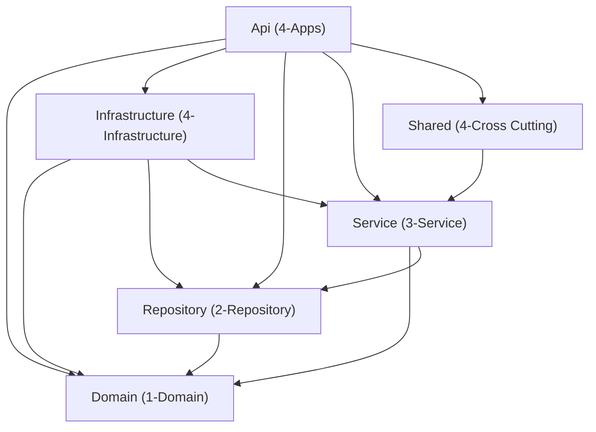

# Complete Technical Guide — Unity Exchange Rates API

## Table of Contents

1. [Project Overview](#1-project-overview)
2. [Technology Stack](#2-technology-stack)
3. [Solution Architecture](#3-solution-architecture)
4. [Domain Layer](#4-domain-layer---unityexchangeratesdomain)
5. [Repository Layer](#5-repository-layer---unityexchangeratesrepository)
6. [Service Layer](#6-service-layer---unityexchangeratesservice)
7. [Infrastructure Layer](#7-infrastructure-layer---unityexchangeratesinfrastructure)
8. [Shared Layer](#8-shared-layer---unityexchangeratesshared)
9. [Api Layer](#9-api-layer---unityexchangeratesapi)
10. [Configuration & Settings](#10-configuration--settings)
11. [Dependency Injection Flow](#11-dependency-injection-flow)
12. [Database Schema](#12-database-schema)
13. [Logging Strategy](#13-logging-strategy)
14. [Background Jobs (Hangfire)](#14-background-jobs-hangfire)
15. [Key Design Decisions](#15-key-design-decisions)
16. [The Interface Pattern — Why, How, and What If Not](#16-the-interface-pattern--why-how-and-what-if-not)
17. [Error Handling — Full Deep-Dive](#17-error-handling--full-deep-dive)
18. [Logger Implementation — Full Deep-Dive](#18-logger-implementation--full-deep-dive)
19. [Unity Facility vs Unity Exchange Rates — Detailed Comparison](#19-unity-facility-vs-unity-exchange-rates--detailed-comparison)
20. [Storing Data in .txt File Before Database](#20-storing-data-in-txt-file-before-database)

---

## 1. Project Overview

### What Does This API Do?

This API fetches daily exchange rates from **Bank Negara Malaysia (BNM)** and stores them in a local SQL Server database for historical tracking and querying.

**Key Features:**

- **GET** exchange rate by currency and date (proxies to BNM API)
- **POST** manual sync — fetch and store rates for all active currencies on a given date
- **Automated daily sync** at midnight using Hangfire
- **Resilient HTTP calls** with Polly retry policy (1s → 2s → 5s backoff)
- **Structured logging** with Serilog (file sink, rolling daily, 30-day retention)
- **Input validation** via FluentValidation pipeline behavior
- **Standardised responses** via FluentResults + BaseResult/BaseResponse

---

## 2. Technology Stack

| Category | Technology | Version |
|---|---|---|
| Framework | ASP.NET Core (Minimal Hosting) | .NET 9.0 |
| CQRS / Mediator | Mediator (source generator) | 3.0.1 |
| Object Mapping | AutoMapper | 13.0.1 |
| Validation | FluentValidation | 11.9.2 |
| Result Pattern | FluentResults | 4.0.0 |
| ORM | Entity Framework Core (SQL Server) | 9.0.2 |
| Background Jobs | Hangfire (SQL Server storage) | 1.8.16 |
| Resilience | Polly | 8.6.3 |
| Logging | Serilog (File sink) | 9.0.0 |
| API Documentation | Swashbuckle / Swagger | 10.1.0 |
| JSON | Newtonsoft.Json + System.Text.Json | 13.0.3 / built-in |

---

## 3. Solution Architecture

### 6-Project Layered Structure

```
Unity.ExchangeRates.svc.slnx
├── /1-Domain/      → Unity.ExchangeRates.Domain
├── /2-Repository/  → Unity.ExchangeRates.Repository
├── /3-Service/     → Unity.ExchangeRates.Service
├── /4-Apps/        → Unity.ExchangeRates.Api
├── /4-Infrastructure/ → Unity.ExchangeRates.Infrastructure
└── /4-Cross Cutting/  → Unity.ExchangeRates.Shared
```

### Dependency Graph



---

## 4. Domain Layer — `Unity.ExchangeRates.Domain`

> **Purpose:** Pure data models and domain exceptions. No logic, no infrastructure dependencies.

### 4.1 `BaseEntity<TId>` — Abstract Base Entity

**File:** `Models/BaseEntity.cs`

```csharp
public abstract class BaseEntity<TId>
{
    [Key]
    public virtual required TId Id { get; set; }
    public DateTime CreatedOn { get; set; }
    public string? CreatedBy { get; set; }
    public DateTime? ModifiedOn { get; set; }
    public string? ModifiedBy { get; set; }
}
```

**Purpose:** All database entities inherit from this. Provides:
- **`Id`** — generic primary key (allows `int`, `string`, or any type)
- **Audit fields** — `CreatedOn`, `CreatedBy`, `ModifiedOn`, `ModifiedBy` (auto-stamped by `EntitySaveChangeInterceptor`)

---

### 4.2 `Currency` — Currency Entity

**File:** `Models/Currency.cs`

```csharp
[Table("Currency")]
public class Currency : BaseEntity<string>
{
    [Key, Column("CurrencyCode"), StringLength(10)]
    public override required string Id { get; set; }

    [NotMapped]
    public string CurrencyCode { get => Id; set => Id = value; }

    [Required, StringLength(100)]
    public required string CurrencyName { get; set; }

    public int UnitBase { get; set; }
}
```

**Purpose:** Represents a currency tracked by the system (e.g., USD, GBP, EUR).

| Property | Type | Description |
|---|---|---|
| `Id` / `CurrencyCode` | `string` | ISO currency code (e.g. "USD"). PK, max 10 chars |
| `CurrencyName` | `string` | Full name (e.g. "US Dollar"). Required, max 100 chars |
| `UnitBase` | `int` | Base units for the exchange rate |

**Note:** `CurrencyCode` is a `[NotMapped]` convenience alias for `Id`.

---

### 4.3 `ExchangeRateHistory` — Rate History Entity

**File:** `Models/ExchangeRateHistory.cs`

```csharp
[Table("ExchangeRateHistory")]
public class ExchangeRateHistory : BaseEntity<int>
{
    [Required, StringLength(10)]
    public required string CurrencyCode { get; set; }
    public DateTime RateDate { get; set; }
    [Column(TypeName = "decimal(18, 4)")]
    public decimal? BuyingRate { get; set; }
    [Column(TypeName = "decimal(18, 4)")]
    public decimal? SellingRate { get; set; }
    [Column(TypeName = "decimal(18, 4)")]
    public decimal? MiddleRate { get; set; }
    public DateTime EffectiveDate { get; set; }
    [ForeignKey(nameof(CurrencyCode))]
    public Currency? Currency { get; set; }
}
```

**Purpose:** One row per currency per date. Stores BNM's buying, selling, and middle rates.

| Property | Type | Description |
|---|---|---|
| `Id` | `int` | Auto-increment PK |
| `CurrencyCode` | `string` | FK to Currency table |
| `RateDate` | `DateTime` | The date this rate applies to |
| `BuyingRate` | `decimal?` | BNM buying rate (precision 18,4) |
| `SellingRate` | `decimal?` | BNM selling rate |
| `MiddleRate` | `decimal?` | BNM middle rate |
| `EffectiveDate` | `DateTime` | When this rate became effective |
| `Currency` | `Currency?` | Navigation property |

---

### 4.4 `BnmApiResponse` — BNM API DTOs

**File:** `Models/BnmApiResponse.cs`

Models for deserialising BNM's JSON response. Uses `System.Text.Json` `[JsonPropertyName]` attributes.

| Class | Properties | Purpose |
|---|---|---|
| `BnmApiResponse` | `Data` (`BnmRateData`), `Meta` (`BnmMeta`) | Top-level response envelope |
| `BnmRateData` | `CurrencyCode`, `Unit`, `Rate` (`RateDetails`) | Currency data with rate details |
| `RateDetails` | `Date`, `BuyingRate`, `SellingRate`, `MiddleRate` | The actual exchange rate numbers |
| `BnmMeta` | `Quote`, `Session`, `LastUpdated`, `TotalResult` | Metadata about the API response |

---

### 4.5 `ExchangeRatesDomainException` — Custom Domain Exception

**File:** `Exceptions/ExchangeRatesDomainException.cs`

```csharp
[Serializable]
public class ExchangeRatesDomainException : Exception
{
    public string Code { get; private set; } = string.Empty;
    // Constructors: (), (message), (code, message), (message, inner), (code, message, inner)
}
```

**Purpose:** Custom exception for domain-specific errors. The `Code` property carries a business error code. Caught by `ExceptionHandlerMiddleware` → returns HTTP 400.

---

## 5. Repository Layer — `Unity.ExchangeRates.Repository`

> **Purpose:** Defines **interfaces only** — no implementations. This is the contract layer.

### 5.1 `IExchangeRateRepository` — Repository Contract

**File:** `IExchangeRateRepository.cs`

```csharp
public interface IExchangeRateRepository
{
    Task<List<Currency>> GetActiveCurrenciesAsync(CancellationToken cancellationToken);
    Task AddRateHistoryAsync(ExchangeRateHistory history, CancellationToken cancellationToken);
    Task<int> SaveChangesAsync(CancellationToken cancellationToken);
}
```

| Method | Purpose |
|---|---|
| `GetActiveCurrenciesAsync` | Returns all currencies from the `Currency` table |
| `AddRateHistoryAsync` | Adds one `ExchangeRateHistory` entity to the change tracker |
| `SaveChangesAsync` | Persists all pending changes to the database; returns count of affected rows |

**Why a separate project?** The Service layer depends on this interface. The Infrastructure layer provides the implementation. This keeps the Service layer free of EF Core dependencies.

---

## 6. Service Layer — `Unity.ExchangeRates.Service`

> **Purpose:** All business logic via CQRS pattern — command/query definitions, handlers, validators, pipeline behaviors, error types, result models, and configuration options.

### 6.1 CQRS: Queries

#### `ExchangeRateQuery`

**File:** `Mediator/Queries/ExchangeRates/ExchangeRateQuery.cs`

```csharp
public class ExchangeRateQuery : IRequest<Result<BaseResult>>
{
    public string? appId { get; set; }
    public string? currency { get; set; }
    public string? date { get; set; }
}
```

A Mediator request to fetch a single exchange rate from BNM for a given currency and date.

#### `ExchangeRateQueryHandler`

**File:** `Mediator/Queries/ExchangeRates/ExchangeRateQueryHandler.cs`

**Dependencies:** `IHttpClientFactory` (named "BnmClient"), `IOptions<BnmApiOptions>`, `ILogger<ExchangeRateQueryHandler>`

**Method: `Handle(ExchangeRateQuery request, CancellationToken ct)`**

1. Builds BNM API URL: `{endpoint}/{currency}/date/{date}?session=1700&quote=rm`
2. Calls `_httpClient.GetAsync(url, ct)` — the HttpClient has Polly retry policy attached
3. If non-success HTTP status → returns `Result.Fail(new GeneralError { errorCode = "00400" })`
4. Deserialises response as `BnmApiResponse` using `ReadFromJsonAsync<BnmApiResponse>()`
5. If null → returns `Result.Fail(new NotFoundError { errorCode = "00404" })`
6. If success → returns `new BaseResult { appId, data = bnmData.Data }`
7. Any exception → catches, logs, returns `Result.Fail(new GeneralError { errorCode = "00500" })`

#### `ExchangeRateQueryValidator`

**File:** `Mediator/Queries/ExchangeRates/ExchangeRateQueryValidator.cs`

```csharp
public sealed class ExchangeRateQueryValidator : AbstractValidator<ExchangeRateQuery>
{
    public ExchangeRateQueryValidator()
    {
        RuleFor(c => c.currency).NotEmpty().WithErrorCode("00400").WithMessage("Currency is required.");
        RuleFor(c => c.date).NotEmpty().WithErrorCode("00400").WithMessage("Date is required.")
            .Matches(@"^\d{4}-\d{2}-\d{2}$").WithErrorCode("00400").WithMessage("Date must be in yyyy-MM-dd format.");
    }
}
```

Runs automatically via `RequestValidationBehavior` pipeline before the handler.

---

### 6.2 CQRS: Commands

#### `ExchangeRateSyncCommand`

**File:** `Mediator/Commands/ExchangeRates/ExchangeRateSyncCommand.cs`

```csharp
public class ExchangeRateSyncCommand : IRequest<Result<BaseResult>>
{
    public string? appId { get; set; }
    public string? date { get; set; }
}
```

A Mediator request to sync all active currencies for a given date.

#### `ExchangeRateSyncCommandHandler`

**File:** `Mediator/Commands/ExchangeRates/ExchangeRateSyncCommandHandler.cs`

**Dependencies:** `IExchangeRateRepository`, `ISender` (Mediator), `ILogger<ExchangeRateSyncCommandHandler>`

**Method: `Handle(ExchangeRateSyncCommand request, CancellationToken ct)`**

1. Calls `_repository.GetActiveCurrenciesAsync(ct)` — loads all currencies
2. For each currency:
   a. Creates `ExchangeRateQuery { appId, currency = curr.Id, date }`
   b. Calls `_mediator.Send(query, ct)` — **reuses the query handler** for BNM API call
   c. If success and `result.ValueOrDefault.data` is `BnmRateData`:
      - Creates `ExchangeRateHistory` entity with rates, dates, `CreatedBy = "System_Mediator"`
      - Calls `_repository.AddRateHistoryAsync(history, ct)`
      - Increments `syncedCount`
   d. If failed → logs warning with error details, skips this currency
3. Calls `_repository.SaveChangesAsync(ct)` — bulk persists all added histories
4. Returns `BaseResult { data = "Synced {syncedCount} of {total} currencies for {date}" }`
5. Any exception → catches, logs, returns `Result.Fail(new GeneralError { errorCode = "00500" })`

#### `ExchangeRateSyncCommandValidator`

**File:** `Mediator/Commands/ExchangeRates/ExchangeRateSyncCommandValidator.cs`

Validates: `date` not empty + matches `yyyy-MM-dd` format.

---

### 6.3 Pipeline Behavior

#### `RequestValidationBehavior<TRequest, TResponse>`

**File:** `Behaviors/RequestValidationBehavior.cs`

```csharp
public class RequestValidationBehavior<TRequest, TResponse> : IPipelineBehavior<TRequest, TResponse>
    where TRequest : IRequest<TResponse>
    where TResponse : ResultBase<TResponse>, new()
```

**How it works:**

1. Receives `IEnumerable<IValidator<TRequest>>` — all registered validators for this request type
2. Creates a `ValidationContext<TRequest>` and runs all validators in parallel
3. Collects failures
4. If any failures:
   - Creates `ValidationError` for each failure, extracting `appId` via reflection from the request
   - Returns a failed `TResponse` with the validation errors (handler is **never called**)
5. If no failures:
   - Calls `next(message, ct)` — proceeds to the actual handler

**Registration:** `services.AddTransient(typeof(IPipelineBehavior<,>), typeof(RequestValidationBehavior<,>))`

---

### 6.4 Error Types

All implement `IError` from FluentResults and carry a standardised error shape:

| Class | File | Default Message | Used For |
|---|---|---|---|
| `GeneralError` | `Common/Errors/GeneralError.cs` | "An error has occurred." | BNM API failures, unexpected errors |
| `NotFoundError` | `Common/Errors/NotFoundError.cs` | "No record or record not found." | BNM returns null/empty |
| `ValidationError` | `Common/Errors/ValidationError.cs` | "One or more validation errors occurred." | FluentValidation failures |

**Common properties on all error types:**

| Property | Type | Description |
|---|---|---|
| `appId` | `string` | Application identifier from the request |
| `status` | `string` | Always `"Failed"` (from `CommonConstants.StandardFormat.FailedStatus`) |
| `timestamp` | `string` | ISO-8601 formatted current time |
| `traceId` | `string` | `Activity.Current?.Id` for distributed tracing |
| `errorCode` | `string` | 5-digit code (e.g. "00400", "00404", "00500") |
| `errorMsg` | `string` | Human-readable error message |
| `data` | `object?` | Optional additional data |

---

### 6.5 Result Model

#### `BaseResult`

**File:** `Models/Results/BaseResult.cs`

```csharp
public class BaseResult
{
    public string appId { get; set; }
    public string status { get; set; } = "Success";
    public string timestamp { get; set; } = DateTime.Now.ToString("yyyy-MM-ddTHH\\:mm\\:ss.fffzzz", CultureInfo.InvariantCulture);
    public string traceId { get; set; } = Activity.Current?.Id;
    public string? errorCode { get; set; }
    public string? errorMsg { get; set; }
    public object? data { get; set; }
}
```

**Purpose:** Standard success response shape. Wrapped in `Result<BaseResult>` from FluentResults. The `data` property holds the actual payload (e.g. `BnmRateData` for queries, summary string for commands).

---

### 6.6 Constants

#### `CommonConstants`

**File:** `Models/Constants/CommonConstants.cs`

```csharp
public struct StandardFormat
{
    public static CultureInfo Culture = new CultureInfo("en-MY", false);
    public const string DateTime = "{0:dd/MM/yyyy}";
    public const string ISODateTime = "yyyy-MM-dd";
    public const string HashDateTime = "yyyyMMdd";
    public const string FailedStatus = "Failed";
}

public class ResponseMessage
{
    public const string GENERAL_ERROR = "An error has occurred.";
    public const string VALIDATOR_ERROR = "One or more validation errors occurred.";
    public const string NOTFOUND_ERROR = "No record or record not found.";
    public const string DUPLICATED_ERROR = "Record already exists.";
}
```

---

### 6.7 Configuration

#### `BnmApiOptions`

**File:** `Configurations/BnmApiOptions.cs`

```csharp
public class BnmApiOptions
{
    public string BaseUrl { get; set; } = string.Empty;
    public string AcceptHeader { get; set; } = "application/vnd.BNM.API.v1+json";
    public Dictionary<string, string> Endpoints { get; set; } = new();
}
```

Bound from `appsettings.json` section `"BnmApiSettings"`.

#### `ErrorCodes`

**File:** `Common/Configuration/ErrorCodes.cs`

Configuration model for error code dictionaries: `DataValidations`, `LogicValidations`, `IntegrationValidations`, `SystemValidations`.

---

### 6.8 Service DI Registration

**File:** `ServiceCollectionExtensions.cs`

**Method: `RegisterServiceModule(IServiceCollection, IConfiguration)`**

1. **`AddService()`:**
   - Sets FluentValidation cascade mode to `Stop` (first failure stops validation)
   - Registers `RequestValidationBehavior` as `IPipelineBehavior<,>`
   - Auto-registers all validators from the assembly
2. **`AddAppSettings()`:**
   - Binds `BnmApiOptions` from configuration section `"BnmApiSettings"`

---

## 7. Infrastructure Layer — `Unity.ExchangeRates.Infrastructure`

> **Purpose:** Implements data access using EF Core. Owns the database context, migrations, interceptors, and repository implementations.

### 7.1 `AppDbContext` — Database Context

**File:** `Data/AppDbContext.cs`

```csharp
public class AppDbContext : DbContext
{
    private readonly EntitySaveChangeInterceptor _interceptor;

    public DbSet<Currency> Currencies { get; set; } = null!;
    public DbSet<ExchangeRateHistory> ExchangeRateHistories { get; set; } = null!;
}
```

**`OnModelCreating` — Fluent API configuration:**

| Entity | Configuration |
|---|---|
| `Currency` | PK on `Id` (column `CurrencyCode`, max 10), `CurrencyName` max 100, table `Currency` |
| `ExchangeRateHistory` | PK on `Id`, `RateDate` default `GETDATE()`, rates as `decimal(18,4)`, table `ExchangeRateHistory` |

---

### 7.2 `EntitySaveChangeInterceptor` — Audit Field Interceptor

**File:** `Interceptors/EntitySaveChangeInterceptor.cs`

```csharp
public class EntitySaveChangeInterceptor : SaveChangesInterceptor
```

Intercepts both `SavingChanges` (sync) and `SavingChangesAsync` (async).

**Method: `UpdateEntities(DbContext? context)`**

Iterates all tracked entities of type `BaseEntity<int>` and `BaseEntity<string>`:
- **Added:** Sets `CreatedOn = DateTime.Now`
- **Added or Modified:** Sets `ModifiedOn = DateTime.Now`

This ensures audit timestamps are always consistent without handlers needing to set them manually.

---

### 7.3 `ExchangeRateRepository` — Repository Implementation

**File:** `Repositories/ExchangeRateRepository.cs`

Implements `IExchangeRateRepository` using `AppDbContext`.

| Method | Implementation | Logging |
|---|---|---|
| `GetActiveCurrenciesAsync` | `_context.Currencies.ToListAsync(ct)` | Debug: "called", Info: "returned {Count} currencies" |
| `AddRateHistoryAsync` | `_context.ExchangeRateHistories.AddAsync(history, ct)` | Debug: "for CurrencyCode={}, RateDate={}" |
| `SaveChangesAsync` | `_context.SaveChangesAsync(ct)` | Debug: "called", Info: "persisted {Count} changes" |

---

### 7.4 Infrastructure DI Registration

**File:** `ServiceCollectionExtensions.cs`

**Method: `RegisterInfrastructureModule(IServiceCollection, IConfiguration)`**

1. **`AddContext()`:**
   - Gets `DefaultConnection` connection string
   - Registers `AppDbContext` with SQL Server provider (600s command timeout)
   - Registers `EntitySaveChangeInterceptor` as scoped
2. **`AddPersistence()`:**
   - Registers `IExchangeRateRepository → ExchangeRateRepository` as scoped

---

## 8. Shared Layer — `Unity.ExchangeRates.Shared`

> **Purpose:** Cross-cutting concerns — Hangfire background jobs and HttpClient configuration.

### 8.1 `IExchangeRateSyncJob` — Job Interface

**File:** `Jobs/IExchangeRateSyncJob.cs`

```csharp
public interface IExchangeRateSyncJob
{
    Task SyncDailyAsync(CancellationToken cancellationToken = default);
}
```

### 8.2 `ExchangeRateSyncJob` — Job Implementation

**File:** `Jobs/ExchangeRateSyncJob.cs`

**Dependencies:** `ISender` (Mediator), `ILogger<ExchangeRateSyncJob>`

**Method: `SyncDailyAsync(CancellationToken ct)`**

1. Calculates target date via `GetPreviousBusinessDate(DateTime.Now)`:
   - Subtracts 1 day from today
   - If Saturday or Sunday, keeps subtracting until reaching a weekday
   - (Monday at midnight → syncs Friday's rates)
2. Creates `ExchangeRateSyncCommand { date = targetDate }`
3. Calls `_mediator.Send(command, ct)`
4. Logs success or failure

---

### 8.3 Shared DI Registration

**File:** `ServiceCollectionExtensions.cs`

**Method: `RegisterSharedServiceModule(IServiceCollection, IConfiguration)`**

1. **`AddHttpClients()`:**
   - Registers named HttpClient `"BnmClient"`:
     - Base address from `BnmApiOptions.BaseUrl`
     - Accept header from `BnmApiOptions.AcceptHeader` (`"application/vnd.BNM.API.v1+json"`)
     - 10-second timeout
   - Adds Polly retry policy via `AddPolicyHandler(BuildRetryPolicy())`:
     - Handles transient HTTP errors (5xx, network failures)
     - Retries 3 times with delays: 1s → 2s → 5s
2. **`AddHangfireServices()`:**
   - Configures Hangfire with SQL Server storage (same connection string)
   - Adds Hangfire server
   - Registers `IExchangeRateSyncJob → ExchangeRateSyncJob` as scoped

---

## 9. Api Layer — `Unity.ExchangeRates.Api`

> **Purpose:** ASP.NET Core host. Controllers, middleware, ViewModels, mapping, configuration, Program.cs bootstrap.

### 9.1 `Program.cs` — Application Bootstrap

**File:** `Program.cs` (120 lines)

#### Startup Sequence:

1. **Serilog bootstrap:** `Log.Logger = new LoggerConfiguration().ReadFrom.Configuration(...).CreateLogger()`
2. **Layer DI registration:**
   - `RegisterServiceModule()` — validators, pipeline behavior, BnmApiOptions
   - `RegisterInfrastructureModule()` — EF Core, repositories
   - `RegisterSharedServiceModule()` — Hangfire, HttpClient + Polly
3. **Mediator:** `AddMediator(opt => opt.ServiceLifetime = ServiceLifetime.Scoped)` — source-gen registration
4. **AutoMapper:** `AddAutoMapper(typeof(Program).Assembly)` — scans for profiles in Api project
5. **CORS:** `ConfigureCors()` — reads `CorsOptions` from config or falls back to allow-all in Development
6. **Controllers + Swagger:** `AddControllers()`, `AddSwaggerGen()`

#### Middleware Pipeline:

1. `ExceptionHandlerMiddleware` — global exception catching
2. Swagger UI (Development only)
3. `UseHttpsRedirection()`
4. `UseCors()`
5. `UseHangfireDashboard()` — dashboard at `/hangfire`
6. `UseAuthorization()`
7. `MapControllers()`

#### Hangfire Recurring Job:

```csharp
RecurringJob.AddOrUpdate<IExchangeRateSyncJob>(
    "daily-exchange-rate-sync",
    job => job.SyncDailyAsync(CancellationToken.None),
    "0 0 * * *",  // Daily at midnight
    new RecurringJobOptions { TimeZone = TimeZoneInfo.Local });
```

#### Graceful Shutdown:

```csharp
try { app.Run(); }
catch (Exception ex) { Log.Fatal(ex, "Application terminated unexpectedly"); }
finally { Log.CloseAndFlush(); }
```

---

### 9.2 `BaseApiController` — Base Controller

**File:** `Controllers/Base/BaseApiController.cs`

All controllers inherit from `BaseApiController : ControllerBase`.

**Key Methods:**

| Method | Signature | Purpose |
|---|---|---|
| `ApiResponse<T>` | `(Result<T> result)` → `IActionResult` | Maps a single FluentResult to HTTP response |
| `ApiResponse<T, T2>` | `(Result<T> responseResult, Result<T2> result)` → `IActionResult` | Maps a response ViewModel result alongside the raw result (used when AutoMapper maps BaseResult → BaseResponse) |
| `UnhandledProblem` | `()` → `IActionResult` | Returns 500 with `BaseResponse` for unhandled exceptions |

**Error Mapping Logic (`HandleFluentResultProblem`):**

| Error Type | HTTP Status |
|---|---|
| `GeneralError` | 400 Bad Request |
| `NotFoundError` | 404 Not Found |
| `ValidationError` | 400 Bad Request |
| Other / null | 500 Internal Server Error |

The method deserialises the `IError` to `BaseResponse` via Newtonsoft.Json to convert error properties into the standard response shape.

---

### 9.3 `ExchangeRateController` — API Endpoints

**File:** `Controllers/ExchangeRateController.cs`

**Route:** `api/exchangerates`

**Dependencies:** `IMapper` (AutoMapper), `ISender` (Mediator), `ILogger<ExchangeRateController>`

#### `GET {currency}/{date}` — Get Exchange Rate

```csharp
[HttpGet("{currency}/{date}")]
public async Task<IActionResult> GetRate(string currency, string date, [FromQuery] string appId = "")
```

1. Creates `ExchangeRateRequest { appId, currency, date }`
2. Maps to `ExchangeRateQuery` via AutoMapper
3. Sends via `_mediator.Send(query)`
4. Maps `BaseResult` → `BaseResponse` via AutoMapper
5. Returns `ApiResponse<BaseResponse, BaseResult>(mappedResponse, result)`

**Responses:** 200 OK, 400 Bad Request, 404 Not Found

#### `POST sync` — Sync Exchange Rates

```csharp
[HttpPost("sync")]
public async Task<IActionResult> Sync([FromBody] ExchangeRateSyncRequest syncRequest)
```

1. Maps `ExchangeRateSyncRequest` → `ExchangeRateSyncCommand` via AutoMapper
2. Sends via `_mediator.Send(command)`
3. Maps result → response
4. Returns `ApiResponse<BaseResponse, BaseResult>(...)`

**Responses:** 200 OK, 400 Bad Request, 500 Internal Server Error

---

### 9.4 `ExceptionHandlerMiddleware` — Global Error Handler

**File:** `Middlewares/ExceptionHandlerMiddleware.cs`

Wraps the entire request pipeline in a try/catch.

| Exception Type | HTTP Status | Response |
|---|---|---|
| `ExchangeRatesDomainException` | 400 | `{ "message": "..." }` |
| `ValidationException` (FluentValidation) | 400 | First distinct error message |
| Any other | 500 | `{ "message": "..." }` |

All exceptions are logged via `_logger.LogError(error, error?.Message)`.

---

### 9.5 ViewModels

#### Request ViewModels

| Class | File | Properties |
|---|---|---|
| `ExchangeRateRequest` | `ViewModels/Request/ExchangeRateRequest.cs` | `appId`, `currency`, `date` |
| `ExchangeRateSyncRequest` | `ViewModels/Request/ExchangeRateSyncRequest.cs` | `appId`, `date` |

Both marked with `[ValidateNever]` — validation is handled by FluentValidation in the pipeline, not by model binding.

#### Response ViewModel

| Class | File | Properties |
|---|---|---|
| `BaseResponse` | `ViewModels/Response/BaseResponse.cs` | `appId`, `status`, `timestamp`, `traceId`, `errorCode`, `errorMsg`, `data` |

Mirrors `BaseResult` in shape but lives in the Api layer.

---

### 9.6 `InitialMapper` — AutoMapper Profile

**File:** `Configurations/InitialMapper.cs`

```csharp
internal class InitialMapper : Profile
{
    public InitialMapper()
    {
        CreateMap<ExchangeRateRequest, ExchangeRateQuery>();        // Request VM → Query
        CreateMap<ExchangeRateSyncRequest, ExchangeRateSyncCommand>(); // Request VM → Command
        CreateMap<BaseResult, BaseResponse>();                       // Result → Response VM
    }
}
```

**Purpose:** Separates the Api layer's ViewModels from the Service layer's CQRS objects. Controllers use AutoMapper instead of manual property mapping.

---

### 9.7 `CorsOptions`

**File:** `Configurations/CorsOptions.cs`

```csharp
public class CorsOptions
{
    public string[] Origins { get; set; }
}
```

Bound from `appsettings.json` section `"CorsOptions"`. If missing in Development → allows all origins. If missing in Production → throws `InvalidOperationException`.

---

## 10. Configuration & Settings

### `appsettings.json` (shared)

```json
{
  "Serilog": {
    "MinimumLevel": { "Default": "Debug", "Override": { "Microsoft": "Information", "Microsoft.AspNetCore": "Warning" } },
    "WriteTo": [{
      "Name": "File",
      "Args": {
        "path": "Logs/exchange-rates-.log",
        "rollingInterval": "Day",
        "retainedFileCountLimit": 30,
        "outputTemplate": "{Timestamp:yyyy-MM-dd HH:mm:ss.fff zzz} [{Level:u3}] {SourceContext}: {Message:lj}{NewLine}{Exception}"
      }
    }]
  }
}
```

### `appsettings.Development.json` (Development-only)

```json
{
  "ConnectionStrings": { "DefaultConnection": "Server=(localdb)\\MSSQLLocalDB;Database=UnityExchangeRatesDb;..." },
  "BnmApiSettings": {
    "BaseUrl": "https://api.bnm.gov.my/",
    "Endpoints": { "ExchangeRate": "public/exchange-rate" },
    "AcceptHeader": "application/vnd.BNM.API.v1+json"
  }
}
```

---

## 11. Dependency Injection Flow

```
Program.cs
│
├── RegisterServiceModule(config)              ─→ Service project
│   ├── AddValidatorsFromAssembly()            ─→ ExchangeRateQueryValidator, ExchangeRateSyncCommandValidator
│   ├── AddTransient(IPipelineBehavior<,>)      ─→ RequestValidationBehavior
│   └── Configure<BnmApiOptions>()             ─→ from "BnmApiSettings" section
│
├── RegisterInfrastructureModule(config)       ─→ Infrastructure project
│   ├── AddDbContext<AppDbContext>()            ─→ SQL Server with 600s timeout
│   ├── AddScoped<EntitySaveChangeInterceptor>()
│   └── AddScoped<IExchangeRateRepository, ExchangeRateRepository>()
│
├── RegisterSharedServiceModule(config)        ─→ Shared project
│   ├── AddHttpClient("BnmClient")             ─→ base URL, Accept header, Polly retry
│   ├── AddHangfire() + AddHangfireServer()    ─→ SQL Server storage
│   └── AddScoped<IExchangeRateSyncJob, ExchangeRateSyncJob>()
│
├── AddMediator(Scoped)                        ─→ Source-gen wires handlers automatically
├── AddAutoMapper(typeof(Program))             ─→ Scans Api assembly for Profile classes
├── AddControllers()
└── AddSwaggerGen()
```

---

## 12. Database Schema

### Currency Table

| Column | Type | Constraints |
|---|---|---|
| `CurrencyCode` | nvarchar(10) | PK |
| `CurrencyName` | nvarchar(100) | NOT NULL |
| `UnitBase` | int | |
| `CreatedOn` | datetime2 | |
| `CreatedBy` | nvarchar(max) | Nullable |
| `ModifiedOn` | datetime2 | Nullable |
| `ModifiedBy` | nvarchar(max) | Nullable |

### ExchangeRateHistory Table

| Column | Type | Constraints |
|---|---|---|
| `Id` | int | PK, identity |
| `CurrencyCode` | nvarchar(10) | FK → Currency.CurrencyCode |
| `RateDate` | datetime2 | Default GETDATE() |
| `BuyingRate` | decimal(18,4) | Nullable |
| `SellingRate` | decimal(18,4) | Nullable |
| `MiddleRate` | decimal(18,4) | Nullable |
| `EffectiveDate` | datetime2 | |
| `CreatedOn` | datetime2 | |
| `CreatedBy` | nvarchar(max) | Nullable |
| `ModifiedOn` | datetime2 | Nullable |
| `ModifiedBy` | nvarchar(max) | Nullable |

---

## 13. Logging Strategy

### Serilog Configuration

- **Sink:** File (`Logs/exchange-rates-{date}.log`)
- **Rolling:** Daily (new file each day)
- **Retention:** 30 days
- **Format:** `{Timestamp} [{Level}] {SourceContext}: {Message}{NewLine}{Exception}`
- **Minimum Level:** Debug (override: Microsoft → Information, ASP.NET → Warning)

### Logging Per Layer

| Layer | Log Level | What Is Logged |
|---|---|---|
| **Program.cs** | Info / Fatal | Startup, shutdown, fatal errors |
| **Controller** | (via Mediator / BaseApiController) | HTTP request/response mapping |
| **Handler** | Info / Debug / Warning / Error | Business operations, BNM API calls, sync progress |
| **Repository** | Debug / Info | Data access operations, row counts |
| **Hangfire Job** | Info / Error | Job start, success, failure |

### Example Log Trace

```
[INF] Hangfire SyncDaily: Starting sync. Now=2026-02-20 00:00:01, TargetDate=2026-02-19
[INF] ExchangeRateSyncCommandHandler: Starting sync for date=2026-02-19
[DBG] Repository: GetActiveCurrenciesAsync called
[INF] Repository: GetActiveCurrenciesAsync returned 5 currencies
[DBG] ExchangeRateQueryHandler: Calling BNM API for currency=USD, date=2026-02-19
[INF] ExchangeRateQueryHandler: Success for currency=USD, date=2026-02-19
[DBG] Repository: AddRateHistoryAsync for CurrencyCode=USD, RateDate=2026-02-19
...
[DBG] Repository: SaveChangesAsync called
[INF] Repository: SaveChangesAsync persisted 5 changes
[INF] ExchangeRateSyncCommandHandler: Completed. Synced 5/5 currencies for 2026-02-19
[INF] Hangfire SyncDaily: Sync succeeded for 2026-02-19
```

---

## 14. Background Jobs (Hangfire)

### Setup

| Component | Configuration |
|---|---|
| **Storage** | SQL Server (same `DefaultConnection` string) |
| **Dashboard** | Enabled at `/hangfire` |
| **Job** | `IExchangeRateSyncJob → ExchangeRateSyncJob` |

### Recurring Job

| Parameter | Value |
|---|---|
| **Job ID** | `"daily-exchange-rate-sync"` |
| **Schedule** | `"0 0 * * *"` (daily at 00:00) |
| **Timezone** | `TimeZoneInfo.Local` |
| **Method** | `SyncDailyAsync(CancellationToken.None)` |

### Cron Decoded: `0 0 * * *`

```
 ┌─ minute (0)
 │ ┌─ hour (0 = midnight)
 │ │ ┌─ day of month (any)
 │ │ │ ┌─ month (any)
 │ │ │ │ ┌─ day of week (any)
 0 0 * * *
```

### Business Day Logic

The Hangfire job syncs the **previous business day's** rates:
- Monday at midnight → syncs **Friday's** rates
- Saturday/Sunday → skips back to Friday
- Tuesday–Friday at midnight → syncs previous day's rates

---

## 15. Key Design Decisions

| Decision | Reasoning |
|---|---|
| **Mediator source-gen over MediatR** | Compile-time code generation — no runtime reflection, better performance |
| **FluentResults over exceptions** | Structured success/failure without try/catch overhead in business logic |
| **FluentValidation pipeline** | Validation runs automatically before every handler — no manual validation calls |
| **Separate Repository & Infrastructure projects** | Service layer depends on interfaces only — zero EF Core dependency in business logic |
| **Named HttpClient with Polly** | Centralised HTTP configuration, automatic retry on transient failures |
| **AutoMapper between ViewModels ↔ CQRS** | Clean separation between API surface (ViewModels) and application layer (Commands/Queries) |
| **EntitySaveChangeInterceptor** | Centralised audit field stamping — handlers don't need to set CreatedOn/ModifiedOn manually |
| **6-project structure** | Follows Unity Facility template — consistent across team projects |

---

## 16. The Interface Pattern — Why, How, and What If Not

### What Is an Interface?

An interface is a **contract** — it defines _what_ methods exist but _not how_ they work. Think of it like a job description: it says "this person must be able to do X, Y, Z" but doesn't say how.

### How Interfaces Work in This Project

There are **3 key interfaces** in this project:

| Interface | Defined In | Implemented By | Registered In |
|---|---|---|---|
| `IExchangeRateRepository` | Repository project | `ExchangeRateRepository` (Infrastructure) | Infrastructure `ServiceCollectionExtensions.cs` |
| `IExchangeRateSyncJob` | Shared project | `ExchangeRateSyncJob` (Shared) | Shared `ServiceCollectionExtensions.cs` |
| `IPipelineBehavior<,>` | Mediator library | `RequestValidationBehavior` (Service) | Service `ServiceCollectionExtensions.cs` |

#### Example: `IExchangeRateRepository` — Step by Step

**Step 1 — Define the contract** (Repository project):

```csharp
// Says "any repository must provide these 3 methods"
public interface IExchangeRateRepository
{
    Task<List<Currency>> GetActiveCurrenciesAsync(CancellationToken cancellationToken);
    Task AddRateHistoryAsync(ExchangeRateHistory history, CancellationToken cancellationToken);
    Task<int> SaveChangesAsync(CancellationToken cancellationToken);
}
```

**Step 2 — Implement it** (Infrastructure project):

```csharp
// Says "HERE is how I actually do it — using EF Core"
public class ExchangeRateRepository : IExchangeRateRepository
{
    private readonly AppDbContext _context;
    public async Task<List<Currency>> GetActiveCurrenciesAsync(CancellationToken ct)
        => await _context.Currencies.ToListAsync(ct);  // actual EF Core call
    // ... other methods
}
```

**Step 3 — Register in DI** (Infrastructure `ServiceCollectionExtensions.cs`):

```csharp
services.AddScoped<IExchangeRateRepository, ExchangeRateRepository>();
// "When someone asks for IExchangeRateRepository, give them ExchangeRateRepository"
```

**Step 4 — Use via interface** (Service layer handler):

```csharp
public class ExchangeRateSyncCommandHandler
{
    private readonly IExchangeRateRepository _repository;  // depends on INTERFACE only

    public ExchangeRateSyncCommandHandler(IExchangeRateRepository repository)
    {
        _repository = repository;  // DI injects ExchangeRateRepository automatically
    }

    public async ValueTask<Result<BaseResult>> Handle(...)
    {
        var currencies = await _repository.GetActiveCurrenciesAsync(ct);
        // Handler has NO idea it's using EF Core. It just calls the interface.
    }
}
```

### Why Use Interfaces?

| Benefit | Explanation | Example |
|---|---|---|
| **Loose coupling** | Service layer doesn't know about EF Core. Swap to Dapper, MongoDB, or a file without touching handlers. | Handler calls `_repository.GetActiveCurrenciesAsync()` — whether that reads from SQL, a file, or an API doesn't matter. |
| **Testability** | In unit tests, create a fake (mock) repository that returns test data without a real database. | `var mockRepo = new Mock<IExchangeRateRepository>(); mockRepo.Setup(r => r.GetActiveCurrenciesAsync(...)).ReturnsAsync(testCurrencies);` |
| **Separation of concerns** | The "what" (interface) lives in one project, the "how" (implementation) in another. | Interface in Repository project, implementation in Infrastructure project. |
| **Swappability** | Change implementation without changing consumers. | Lead asks for `.txt` file storage? Create `TextFileExchangeRateRepository : IExchangeRateRepository` — handlers unchanged. |

### What If You Remove Interfaces?

If you used `ExchangeRateRepository` directly instead of `IExchangeRateRepository`:

```csharp
// WITHOUT interface — handler directly depends on concrete class
public class ExchangeRateSyncCommandHandler
{
    private readonly ExchangeRateRepository _repository;  // ❌ Depends on concrete class
}
```

| Problem | Why It's Bad |
|---|---|
| **Circular dependency** | Service must reference Infrastructure, but Infrastructure already references Service. Won't compile. |
| **Can't unit test without a real database** | `ExchangeRateRepository` needs `AppDbContext` which needs SQL Server. Tests become slow and fragile. |
| **Can't swap implementations** | Switch from EF Core to Dapper? Rewrite every handler. |
| **Violates Dependency Inversion Principle** | High-level modules (handlers) should depend on abstractions (interfaces), not low-level modules (EF Core). |

### Interface Usage Map

```
IExchangeRateRepository (Repository project)
├── IMPLEMENTED BY: ExchangeRateRepository (Infrastructure/Repositories/)
├── USED BY: ExchangeRateSyncCommandHandler (Service layer)
└── REGISTERED: services.AddScoped<IExchangeRateRepository, ExchangeRateRepository>()

IExchangeRateSyncJob (Shared project)
├── IMPLEMENTED BY: ExchangeRateSyncJob (Shared/Jobs/)
├── USED BY: Hangfire RecurringJob in Program.cs
└── REGISTERED: services.AddScoped<IExchangeRateSyncJob, ExchangeRateSyncJob>()

IPipelineBehavior<,> (Mediator library)
├── IMPLEMENTED BY: RequestValidationBehavior (Service/Behaviors/)
├── USED BY: Mediator pipeline — runs automatically before every handler
└── REGISTERED: services.AddTransient(typeof(IPipelineBehavior<,>), typeof(RequestValidationBehavior<,>))

IRequestHandler<,> (Mediator library)
├── IMPLEMENTED BY: ExchangeRateQueryHandler, ExchangeRateSyncCommandHandler
├── USED BY: Mediator — auto-discovers via source generator at compile time
└── REGISTERED: Automatically by AddMediator() — no manual registration
```

---

## 17. Error Handling — Full Deep-Dive

This project has **3 layers of error handling** that work together:

### Layer 1: FluentValidation Pipeline (Preventive)

**Where:** `RequestValidationBehavior` in `Service/Behaviors/`
**When:** Runs **before** every Mediator handler automatically.

```
HTTP Request
    ↓
Controller → _mediator.Send(query)
    ↓
┌───────────────────────────────────────┐
│ RequestValidationBehavior (Pipeline)  │
│                                       │
│ 1. Find all IValidator<TRequest>      │
│    e.g. ExchangeRateQueryValidator    │
│                                       │
│ 2. Run validators in parallel         │
│    var results = await Task.WhenAll(  │
│        _validators.Select(v =>        │
│            v.ValidateAsync(ctx, ct))) │
│                                       │
│ 3. Collect failures                   │
│                                       │
│ 4a. If failures:                      │
│     - Create ValidationError per fail │
│     - Return FAILED Result            │
│       (handler NEVER executes)        │
│                                       │
│ 4b. If no failures:                   │
│     - Call next(message, ct)          │
│     - Handler executes normally       │
└───────────────────────────────────────┘
```

**Example failure:**

```
GET /api/exchangerates//2025-02-12   (empty currency)
    ↓
ExchangeRateQueryValidator: RuleFor(c => c.currency).NotEmpty() → FAILS
    ↓
Pipeline returns: Result.Fail(new ValidationError { errorCode = "00400", errorMsg = "Currency Is Required." })
    ↓
Handler NEVER runs. No BNM API call is made.
    ↓
BaseApiController.HandleValidationProblem() → HTTP 400
```

### Layer 2: FluentResults in Handlers (Business Logic Errors)

**Where:** Inside each handler's `Handle()` method.
**When:** After validation passes, during business logic.

Handlers return `Result<BaseResult>` instead of throwing exceptions:

```csharp
// In ExchangeRateQueryHandler.Handle():
var response = await _httpClient.GetAsync(url, ct);

if (!response.IsSuccessStatusCode)
{
    // DON'T throw — return a typed failure
    return Result.Fail(new GeneralError()
    {
        appId = request.appId, errorCode = "00400",
        errorMsg = $"BNM API returned {response.StatusCode}"
    });
}

var bnmData = await response.Content.ReadFromJsonAsync<BnmApiResponse>(ct);

if (bnmData is null)
{
    return Result.Fail(new NotFoundError()
    {
        appId = request.appId, errorCode = "00404",
        errorMsg = "No exchange rate data found for the given date."
    });
}

// Success path
return new BaseResult() { appId = request.appId, data = bnmData.Data };
```

**Why not throw exceptions?**
- Exceptions are expensive (stack trace allocation)
- `Result<T>` makes success/failure explicit in the return type
- Controller can inspect error type to choose HTTP status code
- No hidden control flow — you see all outcomes in the handler

### Layer 3: ExceptionHandlerMiddleware (Safety Net)

**Where:** `Middlewares/ExceptionHandlerMiddleware.cs` in Api project.
**When:** Catches any exception that escapes Layers 1 and 2 — the last line of defence.

```csharp
public async Task Invoke(HttpContext context)
{
    try
    {
        await _next(context);  // ← entire request pipeline runs here
    }
    catch (Exception error)
    {
        _logger.LogError(error, error?.Message);  // ← ALWAYS logged

        switch (error)
        {
            case ExchangeRatesDomainException:
                response.StatusCode = 400;   // business rule violation
                break;
            case ValidationException e:
                response.StatusCode = 400;   // FluentValidation threw (rare — pipeline usually catches)
                break;
            default:
                response.StatusCode = 500;   // truly unexpected
                break;
        }
        await response.WriteAsync(resultObject.ToString());
    }
}
```

**Registered in Program.cs as the FIRST middleware:**

```csharp
app.UseMiddleware<ExceptionHandlerMiddleware>();  // ← must be first
```

**Why first?** It wraps everything. If Swagger throws, if CORS fails, if authorization fails — this catches it.

### How All 3 Layers Work Together

```
HTTP Request
    ↓
╔═══════════════════════════════════════════╗
║ ExceptionHandlerMiddleware (Layer 3)      ║  ← Wraps EVERYTHING
║   try {                                   ║
║     Controller → _mediator.Send()         ║
║       ↓                                   ║
║     ┌──────────────────────────────┐      ║
║     │ Validation Pipeline (L1)     │      ║  ← Catches bad input
║     │ If invalid → return 400      │      ║
║     │ If valid ↓                   │      ║
║     ├──────────────────────────────┤      ║
║     │ Handler (Layer 2)            │      ║  ← Business logic errors
║     │ BNM error → Fail(400)        │      ║
║     │ Not found → Fail(404)        │      ║
║     │ Success → Ok(BaseResult)     │      ║
║     └──────────────────────────────┘      ║
║       ↓                                   ║
║     BaseApiController.ApiResponse()       ║  ← Maps Result → HTTP
║   } catch {                               ║
║     → 400 / 500 JSON                     ║  ← Safety net
║   }                                       ║
╚═══════════════════════════════════════════╝
    ↓
HTTP Response
```

### Complete Error → HTTP Status Code Mapping

| Source | Error Type | HTTP Code | Example |
|---|---|---|---|
| Validation pipeline | `ValidationError` | 400 | Empty currency, bad date format |
| Handler | `GeneralError` | 400 | BNM API returned 500, timeout |
| Handler | `NotFoundError` | 404 | BNM returned no data for date |
| Handler catch block | `GeneralError` | 400 | Unexpected exception in handler |
| Middleware | `ExchangeRatesDomainException` | 400 | Custom domain rule violation |
| Middleware | `ValidationException` | 400 | FluentValidation threw directly |
| Middleware | Any other exception | 500 | Null reference, DB connection lost |

---

## 18. Logger Implementation — Full Deep-Dive

### How Serilog Is Set Up

**Step 1 — NuGet packages** (Api .csproj):

```xml
<PackageReference Include="Serilog.AspNetCore" Version="9.0.0" />
<PackageReference Include="Serilog.Sinks.File" Version="6.0.0" />
```

**Step 2 — Bootstrap in Program.cs** (FIRST, before any DI):

```csharp
Log.Logger = new LoggerConfiguration()
    .ReadFrom.Configuration(builder.Configuration)  // reads "Serilog" section from appsettings.json
    .Enrich.FromLogContext()                         // adds SourceContext (class name) to each log entry
    .CreateLogger();

builder.Host.UseSerilog();  // replaces default .NET logging with Serilog
```

**Why first?** If any service registration throws during startup, Serilog is already active and captures the error. Without this, startup failures would be silent.

**Step 3 — appsettings.json config:**

| Setting | Value | Meaning |
|---|---|---|
| `Default: Debug` | All app code logs at Debug and above | Repository debug logs, handler info logs — all captured |
| `Override Microsoft: Information` | EF Core, DI only log Info+ | Suppresses noisy Debug from framework |
| `Override Microsoft.AspNetCore: Warning` | Kestrel only logs Warning+ | Suppresses per-request Info logs |
| `path: Logs/exchange-rates-.log` | Rolling file output | Produces `exchange-rates-20260223.log` |
| `rollingInterval: Day` | New file each day | One log file per day |
| `retainedFileCountLimit: 30` | Auto-delete after 30 days | Prevents disk filling up |

### How `ILogger<T>` Works

Every class that needs logging requests `ILogger<T>` via constructor injection. The `T` becomes `{SourceContext}` in log output — so you know which class produced each line.

```csharp
public class ExchangeRateRepository : IExchangeRateRepository
{
    private readonly ILogger<ExchangeRateRepository> _logger;
    //                       ^^^^^^^^^^^^^^^^^^^^^^^^
    //   T = "Unity.ExchangeRates.Infrastructure.Repositories.ExchangeRateRepository"
    //   Appears as {SourceContext} in every log line from this class.

    public ExchangeRateRepository(AppDbContext context, ILogger<ExchangeRateRepository> logger)
    {
        _logger = logger;  // DI provides this automatically — no manual setup
    }

    public async Task<List<Currency>> GetActiveCurrenciesAsync(CancellationToken ct)
    {
        _logger.LogDebug("Repository: GetActiveCurrenciesAsync called");
        //   Output: [DBG] ...ExchangeRateRepository: Repository: GetActiveCurrenciesAsync called

        var list = await _context.Currencies.ToListAsync(ct);

        _logger.LogInformation("Repository: returned {Count} currencies", list.Count);
        //   {Count} = structured logging (named property), NOT $"...{list.Count}" (string interpolation)
        //   Serilog stores Count as a searchable key-value pair. Tools can filter by Count > 0.
        return list;
    }
}
```

**Important:** Use `{PropertyName}` message templates, not `$"{variable}"` string interpolation. Templates enable structured logging — properties stored as searchable key-value pairs.

### Where Every Logger Lives (Complete Map)

The following is a complete list of every class in the solution that uses logging, organised by project layer.

#### Api Layer (`Unity.ExchangeRates.Api`)

| # | Class | File Path | Logger Type | Injection Style | What It Logs | Log Levels Used |
|---|---|---|---|---|---|---|
| 1 | **Program.cs** | `Program.cs` | Serilog static `Log` class | Direct static call — no DI | App startup message (`Log.Information`), fatal crash on unhandled exception (`Log.Fatal`), flush on shutdown (`Log.CloseAndFlush`) | Information, Fatal |
| 2 | **ExceptionHandlerMiddleware** | `Middlewares/ExceptionHandlerMiddleware.cs` | `ILogger<ExceptionHandlerMiddleware>` | Constructor injection | Every uncaught exception that bubbles up through the middleware pipeline — logs the exception object and its message | Error |
| 3 | **ExchangeRateController** | `Controllers/ExchangeRateController.cs` | `ILogger<ExchangeRateController>` | Constructor injection | Logger is injected and available but **not actively used** in current code — reserved for future controller-level diagnostics (e.g., request tracing, input logging) | *(none currently)* |

#### Service Layer (`Unity.ExchangeRates.Service`)

| # | Class | File Path | Logger Type | Injection Style | What It Logs | Log Levels Used |
|---|---|---|---|---|---|---|
| 4 | **ExchangeRateQueryHandler** | `Mediator/Queries/ExchangeRates/ExchangeRateQueryHandler.cs` | `ILogger<ExchangeRateQueryHandler>` | Constructor injection | BNM API URL being called (Debug), non-success HTTP status codes (Warning), empty/null response from BNM (Warning), successful rate retrieval (Info), unhandled exceptions in handler (Error) | Debug, Information, Warning, Error |
| 5 | **ExchangeRateSyncCommandHandler** | `Mediator/Commands/ExchangeRates/ExchangeRateSyncCommandHandler.cs` | `ILogger<ExchangeRateSyncCommandHandler>` | Constructor injection | Sync start with target date (Info), active currency count loaded from repository (Debug), per-currency skip when BNM returns failure (Warning), completion stats — synced X/Y currencies (Info), unhandled exceptions in handler (Error) | Debug, Information, Warning, Error |
| 6 | **RequestValidationBehavior** | `Behaviors/RequestValidationBehavior.cs` | `ILogger<RequestValidationBehavior<TRequest, TResponse>>` | Via `ILoggerFactory` — calls `logger.CreateLogger<>()` in constructor (needed because the class is open-generic) | Validation failure details — structured log of all `ValidationError` objects when any FluentValidation rule fails | Error |

#### Infrastructure Layer (`Unity.ExchangeRates.Infrastructure`)

| # | Class | File Path | Logger Type | Injection Style | What It Logs | Log Levels Used |
|---|---|---|---|---|---|---|
| 7 | **ExchangeRateRepository** | `Repositories/ExchangeRateRepository.cs` | `ILogger<ExchangeRateRepository>` | Constructor injection | Method entry for `GetActiveCurrenciesAsync` (Debug), currency count returned (Info), method entry for `AddRateHistoryAsync` with currency code and date (Debug), `SaveChangesAsync` entry (Debug) and persisted row count (Info) | Debug, Information |
| 8 | **TextFileExchangeRateRepository** | `Repositories/TextFileExchangeRateRepository.cs` | `ILogger<TextFileExchangeRateRepository>` | Constructor injection | Method entry for `GetActiveCurrenciesAsync` (Debug), missing `currencies.txt` file warning with path (Warning), currency count returned with file path (Info), queued rate history record (Debug), `SaveChangesAsync` entry with pending count (Debug), persisted record count to text files (Info) | Debug, Information, Warning |

#### Shared / Cross-Cutting Layer (`Unity.ExchangeRates.Shared`)

| # | Class | File Path | Logger Type | Injection Style | What It Logs | Log Levels Used |
|---|---|---|---|---|---|---|
| 9 | **ExchangeRateSyncJob** | `Jobs/ExchangeRateSyncJob.cs` | `ILogger<ExchangeRateSyncJob>` | Constructor injection | Hangfire job trigger time and computed target date (Info), sync success confirmation (Info), sync failure with error list (Error), unhandled exception serialised as JSON (Error) | Information, Error |

#### Summary Count

| Project | Classes With Logger | Logger Actively Used |
|---|---|---|
| Api | 3 | 2 (ExchangeRateController has logger injected but unused) |
| Service | 3 | 3 |
| Infrastructure | 2 | 2 |
| Shared | 1 | 1 |
| **Total** | **9** | **8** |

### Log Level Guide

| Level | When To Use | Example From This Project |
|---|---|---|
| `LogDebug` | Detailed diagnostics — method entry/exit | `"Repository: GetActiveCurrenciesAsync called"` |
| `LogInformation` | Important business events completed | `"Synced 5/5 currencies for 2026-02-19"` |
| `LogWarning` | Unexpected but recoverable — skipped items | `"Skip USD — BNM returned 404"` |
| `LogError` | Failures needing attention | `"ExchangeRateSyncJob failed: {exception}"` |
| `LogFatal` | App cannot continue (Program.cs only) | `"Application terminated unexpectedly"` |

### Sample Log File Output

File: `Logs/exchange-rates-20260223.log`

```
2026-02-23 00:00:00.123 +08:00 [INF] ...ExchangeRateSyncJob: Hangfire SyncDaily: Starting sync. Now=02/23/2026 00:00:00, TargetDate=2026-02-20
2026-02-23 00:00:00.234 +08:00 [INF] ...ExchangeRateSyncCommandHandler: Starting sync for date=2026-02-20
2026-02-23 00:00:00.345 +08:00 [DBG] ...ExchangeRateRepository: Repository: GetActiveCurrenciesAsync called
2026-02-23 00:00:00.567 +08:00 [INF] ...ExchangeRateRepository: returned 5 currencies
2026-02-23 00:00:00.678 +08:00 [DBG] ...ExchangeRateQueryHandler: Calling BNM API for currency=USD, date=2026-02-20
2026-02-23 00:00:01.234 +08:00 [INF] ...ExchangeRateQueryHandler: Success for currency=USD, date=2026-02-20
2026-02-23 00:00:01.345 +08:00 [DBG] ...ExchangeRateRepository: AddRateHistoryAsync for CurrencyCode=USD, RateDate=2026-02-20
2026-02-23 00:00:05.678 +08:00 [DBG] ...ExchangeRateRepository: SaveChangesAsync called
2026-02-23 00:00:05.890 +08:00 [INF] ...ExchangeRateRepository: SaveChangesAsync persisted 5 changes
2026-02-23 00:00:05.901 +08:00 [INF] ...ExchangeRateSyncCommandHandler: Completed. Synced 5/5 currencies for 2026-02-20
2026-02-23 00:00:05.912 +08:00 [INF] ...ExchangeRateSyncJob: Hangfire SyncDaily: Sync succeeded for 2026-02-20
```

**How to read:** `{Timestamp} [{Level}] {SourceContext}: {Message}` — the `SourceContext` (full class name) tells you exactly which class logged it.

### Graceful Shutdown Logging

```csharp
try
{
    Log.Information("Exchange Rates API starting");  // ← logged on startup
    app.Run();
}
catch (Exception ex)
{
    Log.Fatal(ex, "Application terminated unexpectedly");  // ← if app crashes
}
finally
{
    Log.CloseAndFlush();  // ← CRITICAL: ensures all buffered entries written to file before process exits
}
```

---

## 19. Unity Facility vs Unity Exchange Rates — Detailed Comparison

Both projects follow the **same clean architecture template**.

### Architecture (Identical)

| Aspect | Both Projects |
|---|---|
| Layer count | 6 projects |
| Solution folders | 1-Domain, 2-Repository, 3-Service, 4-Apps, 4-Infrastructure, 4-Cross Cutting |
| CQRS | Mediator source-gen |
| Validation | FluentValidation + RequestValidationBehavior pipeline |
| Result pattern | FluentResults (GeneralError, NotFoundError, ValidationError) |
| Error shape | appId, status, timestamp, traceId, errorCode, errorMsg, data |
| DI pattern | RegisterServiceModule / RegisterInfrastructureModule / RegisterSharedServiceModule |
| Base controller | BaseApiController with ApiResponse + FluentResult error mapping |
| Interceptor | EntitySaveChangeInterceptor |
| Middleware | ExceptionHandlerMiddleware |
| AutoMapper | InitialMapper profile in Api/Configurations |
| Constants | CommonConstants (StandardFormat, ResponseMessage) |

### Technology Differences

| Aspect | Facility | Exchange Rates |
|---|---|---|
| .NET version | .NET 8 | .NET 9 |
| Domain target | netstandard2.1 | net9.0 |
| Mediator version | 2.1.7 | 3.0.1 |
| Audit logging | Audit.NET + Audit.WebApi.Core | Not implemented (not needed yet) |
| Rate limiting | AspNetCoreRateLimit | Not implemented |
| API versioning | Microsoft.AspNetCore.Mvc.Versioning | Not implemented |
| Health checks | EPP.Core.Web.HealthChecks | Not implemented |
| Background jobs | None | Hangfire (daily sync) |
| HTTP resilience | None | Polly retry (1s → 2s → 5s) |
| External API | None (DB-only facility data) | BNM Exchange Rate API |
| JSON serialisation | Newtonsoft.Json only | Newtonsoft.Json + System.Text.Json |

### Business Domain Differences

| Aspect | Facility | Exchange Rates |
|---|---|---|
| Purpose | Serves reference/lookup data (occupations, countries, postcodes, products) | Fetches and stores daily exchange rates from BNM |
| Data source | SQL Server database only | BNM external API → SQL Server |
| Operations | Read-only queries (GET endpoints) | Read (GET rate) + Write (POST sync, Hangfire auto-sync) |
| Commands | No commands (read-only) | ExchangeRateSyncCommand (writes to DB) |
| Queries | Multiple — References, Facilities, OccupationClasses, PostCodeCityStates, CountriesNationalities | Single — ExchangeRateQuery |
| Entities | Many — ReferUp, OccupationalClass, CountryNationality, PostCodeCityState, Product, Company, etc. | 2 — Currency, ExchangeRateHistory |
| Shared layer | File service, virus check service, audit log dispatcher | Hangfire jobs, HttpClient + Polly |

### What Facility Has That Exchange Rates Doesn't (Yet)

| Feature | Why Facility Has It | Whether Exchange Rates Needs It |
|---|---|---|
| Audit.NET logging | Regulatory audit trail requirement | Not needed yet — Serilog file logs are sufficient |
| Rate limiting | Public-facing API protection | Can add later if API is exposed publicly |
| API versioning | Multiple API consumers with backward compatibility | Can add later when v2 is needed |
| Health checks | Kubernetes/load-balancer probes | Can add later for production deployment |
| CORS with specific origins | Production frontend apps | Currently development-only with allow-all |

---

## 20. Storing Data in .txt File Before Database — Recommendation

### The Requirement

Your lead wants exchange rate data stored in `.txt` files first (before committing to a full SQL Server database).

### Option A: TextFile Repository (Recommended)

Create an alternative repository that writes to text files. Thanks to the interface pattern (Section 16), **zero handler changes** needed.

**New file:** `Infrastructure/Repositories/TextFileExchangeRateRepository.cs`

```csharp
public class TextFileExchangeRateRepository : IExchangeRateRepository
{
    private readonly string _dataDir;
    private readonly ILogger<TextFileExchangeRateRepository> _logger;
    private readonly List<ExchangeRateHistory> _pending = new();

    public TextFileExchangeRateRepository(IConfiguration config, ILogger<TextFileExchangeRateRepository> logger)
    {
        _dataDir = config.GetValue<string>("TextFileStorage:DataDirectory") ?? "Data";
        _logger = logger;
        Directory.CreateDirectory(_dataDir);
    }

    public Task<List<Currency>> GetActiveCurrenciesAsync(CancellationToken ct)
    {
        var file = Path.Combine(_dataDir, "currencies.txt");
        if (!File.Exists(file)) return Task.FromResult(new List<Currency>());
        return Task.FromResult(File.ReadAllLines(file)
            .Where(l => !string.IsNullOrWhiteSpace(l))
            .Select(l => {
                var p = l.Split('|');
                return new Currency { Id = p[0], CurrencyName = p[1], UnitBase = int.Parse(p[2]) };
            }).ToList());
    }

    public Task AddRateHistoryAsync(ExchangeRateHistory history, CancellationToken ct)
    {
        _pending.Add(history);
        _logger.LogDebug("TextFileRepo: Queued {CurrencyCode} for {RateDate}", history.CurrencyCode, history.RateDate);
        return Task.CompletedTask;
    }

    public Task<int> SaveChangesAsync(CancellationToken ct)
    {
        foreach (var h in _pending)
        {
            var filePath = Path.Combine(_dataDir, $"rates-{h.RateDate:yyyy-MM-dd}.txt");
            var line = $"{h.CurrencyCode}|{h.RateDate:yyyy-MM-dd}|{h.BuyingRate}|{h.SellingRate}|{h.MiddleRate}|{h.EffectiveDate:yyyy-MM-dd}|{DateTime.Now:yyyy-MM-dd HH:mm:ss}";
            File.AppendAllText(filePath, line + Environment.NewLine);
        }
        var count = _pending.Count;
        _logger.LogInformation("TextFileRepo: Saved {Count} records to text files", count);
        _pending.Clear();
        return Task.FromResult(count);
    }
}
```

**Switch in DI** (one line in Infrastructure `ServiceCollectionExtensions.cs`):

```csharp
// services.AddScoped<IExchangeRateRepository, ExchangeRateRepository>();       // DB mode
services.AddScoped<IExchangeRateRepository, TextFileExchangeRateRepository>();   // File mode
```

**Seed `Data/currencies.txt`** (create manually):

```
USD|US Dollar|1
EUR|Euro|1
GBP|Pound Sterling|1
SGD|Singapore Dollar|1
JPY|Japanese Yen|100
```

**Output files produced:**

```
Data/
├── currencies.txt            ← You create this (input)
├── rates-2026-02-20.txt     ← USD|2026-02-20|4.4350|4.4650|4.4500|2026-02-20|2026-02-23 00:00:05
├── rates-2026-02-21.txt
└── rates-2026-02-23.txt
```

**To switch back to database later:** Uncomment `ExchangeRateRepository`, comment `TextFileExchangeRateRepository`. No other code changes.

### Option B: Comment Out Hangfire + DB (Simpler but No Persistence)

1. Comment the Hangfire recurring job in `Program.cs`
2. Comment `AddHangfire()` + `AddHangfireServer()` in Shared `ServiceCollectionExtensions.cs`
3. Comment `app.UseHangfireDashboard()` in `Program.cs`

**Downside:** GET endpoint still works (reads live from BNM API), but POST sync and Hangfire won't persist. Data is lost.

### Recommendation Summary

| Approach | Effort | Data Persisted? | Hangfire Works? | Handlers Changed? | Switch to DB |
|---|---|---|---|---|---|
| **Option A: TextFile Repository** | Medium (1 new class) | Yes, to .txt files | Yes | None | Swap 1 DI line |
| **Option B: Comment Hangfire** | Low (comment 3 blocks) | No | No | None | Uncomment |

**Option A is recommended** — preserves data, Hangfire keeps running, demonstrates the interface pattern's power. When ready for the database, swap one DI registration line.
