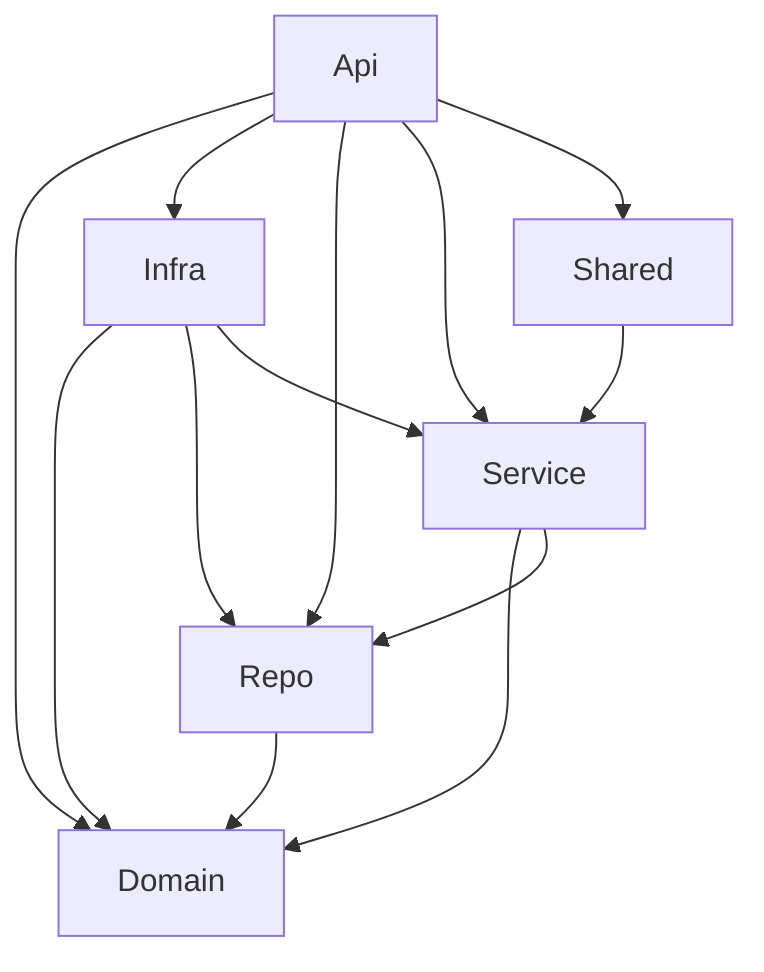

# Presentation Guide — Unity Exchange Rates API

> A structured guide for presenting the Unity Exchange Rates API project to your team, line manager, and leader.

---

## Slide 1: Project Overview

### What Is This?

An API that **automatically fetches daily exchange rates from Bank Negara Malaysia (BNM)** and stores them in a local database for historical tracking.

### Key Features

| Feature | Description |
|---|---|
| **Query rates** | `GET /api/exchangerates/{currency}/{date}` — fetch rate from BNM |
| **Sync rates** | `POST /api/exchangerates/sync` — fetch & store all currencies for a date |
| **Auto sync** | Hangfire runs daily at midnight — syncs previous business day automatically |
| **Resilient** | Polly retry policy (3 retries: 1s → 2s → 5s) for BNM API calls |
| **Logged** | Serilog file logging with 30-day rolling retention |

---

## Slide 2: Architecture — 6-Project Layered Structure

### Why 6 Projects?

Follows the **Unity team's standard template** (same as Unity Facility). Each project has **one job** — separation of concerns.

```
┌────────────────────────────────────────────────────┐
│                  Unity.ExchangeRates.Api            │  ← HTTP entry point (controllers, middleware)
│                  (4-Apps)                            │
├────────────────────────────────────────────────────┤
│  Unity.ExchangeRates.Infrastructure                 │  ← EF Core, DB access, repo implementations
│  (4-Infrastructure)                                 │
├────────────────────────────────────────────────────┤
│  Unity.ExchangeRates.Shared                         │  ← Hangfire jobs, HttpClient + Polly
│  (4-Cross Cutting)                                  │
├────────────────────────────────────────────────────┤
│  Unity.ExchangeRates.Service                        │  ← CQRS handlers, validators, pipeline
│  (3-Service)                                        │
├────────────────────────────────────────────────────┤
│  Unity.ExchangeRates.Repository                     │  ← Interfaces / contracts only
│  (2-Repository)                                     │
├────────────────────────────────────────────────────┤
│  Unity.ExchangeRates.Domain                         │  ← Entities, exceptions (zero dependencies)
│  (1-Domain)                                         │
└────────────────────────────────────────────────────┘
```

### Dependency Graph



**Key rule:** Domain has zero project references — it is the innermost layer.

---

## Slide 3: How CQRS Works (Mediator Pattern)

### What Is CQRS?

**C**ommand **Q**uery **R**esponsibility **S**egregation — separate reads from writes.

| Type | Class | What It Does |
|---|---|---|
| **Query** | `ExchangeRateQuery` | Fetches one currency rate from BNM API |
| **Command** | `ExchangeRateSyncCommand` | Fetches + saves all currencies to DB |

### The Request Pipeline

```
Controller → AutoMapper → _mediator.Send(request)
                              ↓
                   RequestValidationBehavior
                   (FluentValidation runs here)
                              ↓
                   Handler executes business logic
                              ↓
                   Returns Result<BaseResult>
                              ↓
Controller ← AutoMapper ← maps to BaseResponse ← HTTP 200/400/404
```

### Talking Points

- We use **Mediator source-generator** (not MediatR) — compile-time, no reflection, better performance
- Validation happens **automatically** in the pipeline — handlers don't need to validate input themselves
- The Sync command internally **re-sends Query requests** via Mediator to reuse the BNM API call logic

---

## Slide 4: Error Handling Strategy

### Three Layers of Error Handling

| Layer | Mechanism | Example |
|---|---|---|
| **Validation** | `RequestValidationBehavior` + FluentValidation | Missing date, wrong format → 400 |
| **Business logic** | `Result<BaseResult>` + FluentResults error types | BNM returns null → 404 |
| **Global** | `ExceptionHandlerMiddleware` | Uncaught exception → 500 |

### Error Types

| Type | HTTP | When |
|---|---|---|
| `ValidationError` | 400 | Input validation fails |
| `GeneralError` | 400 | BNM API returns non-success, or business error |
| `NotFoundError` | 404 | BNM API returns empty/null data |

### Standardised Response Shape

All errors return the same JSON structure — consistent for consumers:

```json
{
  "appId": "exchange-rates-api",
  "status": "Failed",
  "timestamp": "2026-02-20T00:00:01+08:00",
  "traceId": "00-abc123...",
  "errorCode": "00400",
  "errorMsg": "Date is required.",
  "data": null
}
```

---

## Slide 5: Data Flow — Complete Request Lifecycle

### GET `/api/exchangerates/USD/2025-02-12`

```
1. HTTP GET arrives at ExchangeRateController.GetRate()
2. AutoMapper: ExchangeRateRequest → ExchangeRateQuery
3. _mediator.Send(query)
4. RequestValidationBehavior runs ExchangeRateQueryValidator
   ✓ currency = "USD" (valid)
   ✓ date = "2025-02-12" (valid format)
5. ExchangeRateQueryHandler.Handle()
   → Builds URL: https://api.bnm.gov.my/public/exchange-rate/USD/date/2025-02-12
   → HttpClient.GetAsync(url) — "BnmClient" with Polly retry
   → Deserialise JSON → BnmApiResponse
   → Return Result.Ok(BaseResult { data = rate })
6. AutoMapper: BaseResult → BaseResponse
7. BaseApiController.ApiResponse() → 200 OK
```

### POST `/api/exchangerates/sync`

```
1. HTTP POST with body { "appId": "...", "date": "2025-02-12" }
2. AutoMapper: ExchangeRateSyncRequest → ExchangeRateSyncCommand
3. _mediator.Send(command)
4. RequestValidationBehavior runs ExchangeRateSyncCommandValidator
5. ExchangeRateSyncCommandHandler.Handle()
   → Load all currencies from DB (repository)
   → For EACH currency:
       → Send ExchangeRateQuery via _mediator.Send() (reuses query handler!)
       → If success → create ExchangeRateHistory entity → add to DB
       → If failed → log warning, skip
   → repository.SaveChangesAsync() — bulk save
   → Return "Synced 5 of 5 currencies for 2025-02-12"
6. BaseApiController.ApiResponse() → 200 OK
```

---

## Slide 6: Background Jobs (Hangfire)

### Automated Daily Sync

| Setting | Value |
|---|---|
| **Job ID** | `daily-exchange-rate-sync` |
| **Schedule** | `0 0 * * *` (daily at midnight) |
| **Timezone** | Local |
| **Dashboard** | `/hangfire` |

### How It Works

```
Midnight → Hangfire triggers ExchangeRateSyncJob.SyncDailyAsync()
  → Calculates previous business day
     (Monday night → Friday, Tuesday night → Monday, etc.)
  → Creates ExchangeRateSyncCommand { date = previous business day }
  → Sends via Mediator → same handler as manual POST sync
  → Rates stored in DB automatically
```

### Talking Points

- Zero manual intervention needed after deployment
- Uses the **same command handler** as the manual sync endpoint — no code duplication
- Hangfire dashboard for monitoring at `/hangfire`
- Jobs survive app restarts (SQL Server storage)

---

## Slide 7: Logging Strategy (Serilog)

### Configuration

| Setting | Value |
|---|---|
| **Sink** | File (`Logs/exchange-rates-{date}.log`) |
| **Rolling** | Daily |
| **Retention** | 30 days |
| **Format** | `{Timestamp} [{Level}] {SourceContext}: {Message}` |

### What Gets Logged

| Layer | Examples |
|---|---|
| **Program.cs** | `[INF] Application is starting...` |
| **Handlers** | `[INF] ExchangeRateQueryHandler: Calling BNM API for USD on 2025-02-12` |
| **Repository** | `[DBG] GetActiveCurrenciesAsync returned 5 currencies` |
| **Hangfire** | `[INF] SyncDaily: Sync succeeded for 2025-02-12` |
| **Errors** | `[ERR] ExceptionHandlerMiddleware: {exception}` |

### Talking Points

- `SourceContext` tells you exactly which class logged the message
- Debug logs for data access (repo), Info for business operations (handlers)
- Rolling daily files keep disk usage under control

---

## Slide 8: Resilience (Polly)

### Named HttpClient: "BnmClient"

```
Retry Policy: 3 attempts
  Attempt 1: immediate
  Attempt 2: wait 1 second, retry
  Attempt 3: wait 2 seconds, retry
  Attempt 4: wait 5 seconds, retry
  After 4 total attempts: hard fail → GeneralError
```

### What Triggers a Retry?

- HTTP 5xx responses (Server Error)
- Network timeouts (10-second default)
- Transient network failures

### Talking Points

- External API (BNM) can have intermittent issues — Polly handles this automatically
- Exponential backoff prevents overwhelming the API during outages
- Zero code changes needed in handlers — policy is attached at DI level

---

## Slide 9: Database Design

### Two Tables

```
┌──────────────────────────┐       ┌────────────────────────────────┐
│       Currency           │       │     ExchangeRateHistory         │
├──────────────────────────┤       ├────────────────────────────────┤
│ CurrencyCode (PK)  varchar│ ←──FK │ Id (PK)            int identity│
│ CurrencyName        varchar│       │ CurrencyCode        varchar    │
│ UnitBase             int   │       │ RateDate            datetime   │
│ CreatedOn          datetime│       │ BuyingRate          decimal    │
│ CreatedBy          varchar │       │ SellingRate         decimal    │
│ ModifiedOn         datetime│       │ MiddleRate          decimal    │
│ ModifiedBy         varchar │       │ EffectiveDate       datetime   │
└──────────────────────────┘       │ CreatedOn           datetime   │
                                    │ CreatedBy           varchar    │
                                    │ ModifiedOn          datetime   │
                                    │ ModifiedBy          varchar    │
                                    └────────────────────────────────┘
```

### Talking Points

- Audit fields (`CreatedOn`, `ModifiedOn`) are auto-set by `EntitySaveChangeInterceptor` — handlers don't need to remember
- `BaseEntity<TId>` generic base supports both `string` PK (Currency) and `int` PK (ExchangeRateHistory)
- EF Core Code-First with migrations — schema is version-controlled

---

## Slide 10: Technology Highlights

| Technology | Why We Chose It |
|---|---|
| **Mediator (source-gen)** | Compile-time CQRS — no reflection, faster than MediatR |
| **FluentResults** | Structured success/failure without throwing exceptions |
| **FluentValidation** | Declarative validation rules, auto-run via pipeline |
| **AutoMapper** | Clean separation between ViewModels and CQRS objects |
| **Polly** | Automatic retry for external API calls |
| **Hangfire** | Reliable background jobs with SQL Server persistence |
| **Serilog** | Structured logging with `SourceContext` — know exactly where logs come from |
| **EF Core Interceptors** | Centralised audit — no manual `CreatedOn` stamping |

---

## Anticipated Questions & Answers

### Q: Why not MediatR?

**A:** Mediator (source-gen) generates dispatch code at compile time, avoiding runtime reflection. Same CQRS pattern, better performance, smaller runtime footprint.

### Q: Why separate Repository and Infrastructure projects?

**A:** The Service layer (handlers) depends on `IExchangeRateRepository` (interface). The Infrastructure layer implements it with EF Core. This means the Service layer has zero knowledge of EF Core, SQL Server, or any database technology — making it testable and swappable.

### Q: What happens if BNM API is down?

**A:** Polly retries 3 times (1s, 2s, 5s delays). If all retries fail, the handler returns `Result.Fail(GeneralError)` which becomes an HTTP 400: `"An error has occurred"`. In the Sync command, individual currency failures are logged and skipped — other currencies still sync.

### Q: How do we add a new currency to track?

**A:** Insert a row into the `Currency` table. The Sync command calls `GetActiveCurrenciesAsync()` which reads all rows — the new currency will be included automatically in the next sync.

### Q: Can we change the sync schedule?

**A:** Yes — change the cron expression `"0 0 * * *"` in `Program.cs`. Examples: `"0 8 * * *"` (8 AM daily), `"0 */6 * * *"` (every 6 hours). Hangfire dashboard at `/hangfire` shows the schedule.

### Q: Where are the logs?

**A:** `src/Unity.ExchangeRates.Api/Logs/exchange-rates-{date}.log`. New file each day, automatically deleted after 30 days.

### Q: How does the project follow the team template?

**A:** Same 6-project structure as Unity Facility:
- Same numbered solution folders (1-Domain through 4-Apps/Infrastructure/Cross Cutting)
- Same DI registration pattern (`RegisterXModule()`)
- Same tooling (Mediator, FluentValidation, FluentResults, Serilog)
- Consistent across all Unity team projects
