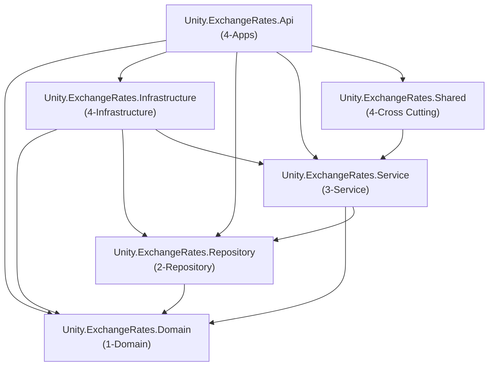

# Project Structure & Architecture — Unity Exchange Rates API

This document explains the **6-project layered architecture**, what each project does, how they depend on each other, and how the solution is organised.

---

## 1. Solution Overview

The solution is split into **6 separate C# projects**, grouped by numbered solution folders in the `.slnx` file:

| Solution Folder | Project | Role |
|---|---|---|
| 1-Domain | `Unity.ExchangeRates.Domain` | Entity models, domain exceptions |
| 2-Repository | `Unity.ExchangeRates.Repository` | Repository **interfaces** (contracts) |
| 3-Service | `Unity.ExchangeRates.Service` | CQRS (Mediator), validators, pipeline behavior, error types, configuration models |
| 4-Apps | `Unity.ExchangeRates.Api` | ASP.NET Core web API host — controllers, middleware, Program.cs |
| 4-Infrastructure | `Unity.ExchangeRates.Infrastructure` | EF Core DbContext, repository **implementations**, interceptors, migrations |
| 4-Cross Cutting | `Unity.ExchangeRates.Shared` | Hangfire jobs, HttpClient + Polly setup |

---

## 2. Project Dependency Graph

Dependencies flow **inward** — outer projects reference inner ones, never the reverse.



**Key rule:** `Domain` has **zero** project references — it is the innermost layer.

---

## 3. Project-by-Project Breakdown

### 3.1 Unity.ExchangeRates.Domain (1-Domain)

> The **innermost** layer. Contains entity models and domain exceptions. No business logic, no infrastructure.

```
Unity.ExchangeRates.Domain/
├── Models/
│   ├── BaseEntity.cs              ← Generic abstract base with audit fields (Id, CreatedOn, ModifiedOn, etc.)
│   ├── Currency.cs                ← Currency entity (CurrencyCode, CurrencyName, UnitBase)
│   ├── ExchangeRateHistory.cs     ← Rate history entity (buying/selling/middle rates, date, FK to Currency)
│   └── BnmApiResponse.cs         ← DTOs for deserialising BNM API JSON responses
├── Exceptions/
│   └── ExchangeRatesDomainException.cs  ← Custom domain exception with error Code
└── Unity.ExchangeRates.Domain.csproj
    └── Dependencies: Mediator.Abstractions (for IRequest marker only)
```

---

### 3.2 Unity.ExchangeRates.Repository (2-Repository)

> Contains **interfaces only** — contracts that define what data operations are available. No implementations here.

```
Unity.ExchangeRates.Repository/
├── IExchangeRateRepository.cs     ← GetActiveCurrenciesAsync, AddRateHistoryAsync, SaveChangesAsync
└── Unity.ExchangeRates.Repository.csproj
    └── References: Domain
```

**Why separate?** Handlers in the Service layer depend on `IExchangeRateRepository` (abstraction). The concrete implementation lives in Infrastructure, so the Service layer never knows about EF Core or SQL.

---

### 3.3 Unity.ExchangeRates.Service (3-Service)

> The **application/business logic** layer. Contains all CQRS command/query definitions, handlers, validators, pipeline behaviors, and shared error/result types.

```
Unity.ExchangeRates.Service/
├── Mediator/
│   ├── Commands/
│   │   └── ExchangeRates/
│   │       ├── ExchangeRateSyncCommand.cs          ← IRequest<Result<BaseResult>>
│   │       ├── ExchangeRateSyncCommandHandler.cs   ← Fetches all currencies, calls query per currency, saves to DB
│   │       └── ExchangeRateSyncCommandValidator.cs ← FluentValidation: date required, yyyy-MM-dd format
│   └── Queries/
│       └── ExchangeRates/
│           ├── ExchangeRateQuery.cs                ← IRequest<Result<BaseResult>>
│           ├── ExchangeRateQueryHandler.cs         ← Calls BNM API via HttpClient, returns rate data
│           └── ExchangeRateQueryValidator.cs       ← FluentValidation: currency + date required
├── Behaviors/
│   └── RequestValidationBehavior.cs  ← Mediator IPipelineBehavior — runs FluentValidation before every handler
├── Common/
│   ├── Configuration/
│   │   └── ErrorCodes.cs            ← Dictionary-based error code configuration model
│   └── Errors/
│       ├── GeneralError.cs          ← IError for general/500 errors
│       ├── NotFoundError.cs         ← IError for 404 errors
│       └── ValidationError.cs      ← IError for 400 validation errors (with Metadata support)
├── Configurations/
│   └── BnmApiOptions.cs            ← Options model for BNM API base URL, endpoints, Accept header
├── Models/
│   ├── Constants/
│   │   └── CommonConstants.cs       ← StandardFormat (culture, date formats, FailedStatus), ResponseMessage constants
│   └── Results/
│       └── BaseResult.cs            ← Standard success response shape (appId, status, timestamp, traceId, data)
├── ServiceCollectionExtensions.cs   ← RegisterServiceModule: FluentValidation, IPipelineBehavior, BnmApiOptions
└── Unity.ExchangeRates.Service.csproj
    └── References: Domain, Repository
    └── Packages: FluentResults, FluentValidation, Mediator.Abstractions, Newtonsoft.Json, AutoMapper
```

---

### 3.4 Unity.ExchangeRates.Infrastructure (4-Infrastructure)

> **Persistence** layer. Implements the repository interfaces using EF Core. Owns the database context, migrations, and EF interceptors.

```
Unity.ExchangeRates.Infrastructure/
├── Data/
│   └── AppDbContext.cs               ← DbContext with DbSet<Currency>, DbSet<ExchangeRateHistory>, Fluent API config
├── Interceptors/
│   └── EntitySaveChangeInterceptor.cs ← SaveChangesInterceptor: auto-stamps CreatedOn/ModifiedOn on add/update
├── Repositories/
│   └── ExchangeRateRepository.cs     ← Implements IExchangeRateRepository using AppDbContext
├── Migrations/
│   ├── 20260206022423_InitialDB.cs
│   ├── 20260206022423_InitialDB.Designer.cs
│   └── AppDbContextModelSnapshot.cs
├── ServiceCollectionExtensions.cs    ← RegisterInfrastructureModule: DbContext (SQL Server), interceptor, repository DI
└── Unity.ExchangeRates.Infrastructure.csproj
    └── References: Domain, Repository, Service
    └── Packages: Microsoft.EntityFrameworkCore, EF SqlServer, EF Tools
```

---

### 3.5 Unity.ExchangeRates.Shared (4-Cross Cutting)

> **Cross-cutting concerns**: Hangfire background jobs, HttpClient configuration with Polly resilience.

```
Unity.ExchangeRates.Shared/
├── Jobs/
│   ├── IExchangeRateSyncJob.cs        ← Interface: SyncDailyAsync
│   └── ExchangeRateSyncJob.cs         ← Implementation: calculates previous business day, sends ExchangeRateSyncCommand via Mediator
├── ServiceCollectionExtensions.cs     ← RegisterSharedServiceModule: named HttpClient "BnmClient" with Polly retry, Hangfire services
└── Unity.ExchangeRates.Shared.csproj
    └── References: Service
    └── Packages: Hangfire, Polly, Mediator.Abstractions
```

---

### 3.6 Unity.ExchangeRates.Api (4-Apps)

> The **ASP.NET Core host**. Controllers, middleware, ViewModels, AutoMapper profiles, Program.cs bootstrap. Thin layer — no business logic.

```
Unity.ExchangeRates.Api/
├── Controllers/
│   ├── Base/
│   │   └── BaseApiController.cs       ← Generic ApiResponse<T> methods, handles FluentResults → HTTP status mapping
│   └── ExchangeRateController.cs     ← GET {currency}/{date}, POST sync — maps ViewModels via AutoMapper, dispatches via _mediator.Send()
├── Middlewares/
│   └── ExceptionHandlerMiddleware.cs  ← Global try/catch: ExchangeRatesDomainException→400, ValidationException→400, else→500
├── ViewModels/
│   ├── Request/
│   │   ├── ExchangeRateRequest.cs     ← appId, currency, date
│   │   └── ExchangeRateSyncRequest.cs ← appId, date
│   └── Response/
│       └── BaseResponse.cs            ← appId, status, timestamp, traceId, errorCode, errorMsg, data
├── Configurations/
│   ├── CorsOptions.cs                 ← CORS origins array
│   └── InitialMapper.cs              ← AutoMapper Profile: Request→Query/Command, BaseResult→BaseResponse
├── Program.cs                         ← Bootstrap: Serilog, multi-layer DI registration, Mediator, AutoMapper, CORS, Swagger, Hangfire recurring job, middleware pipeline
├── appsettings.json                   ← Serilog config (file sink, rolling daily, 30-day retention)
├── appsettings.Development.json       ← Connection string, BNM API settings
├── docs/                              ← This documentation folder
└── Unity.ExchangeRates.Api.csproj
    └── References: Domain, Infrastructure, Repository, Service, Shared
    └── Packages: AutoMapper, Mediator.SourceGenerator, Newtonsoft.Json, Serilog, Swashbuckle
```

---

## 4. Architecture Patterns

### CQRS (Command Query Responsibility Segregation)

- **Queries** (read-only): `ExchangeRateQuery` → `ExchangeRateQueryHandler` → calls BNM API
- **Commands** (write): `ExchangeRateSyncCommand` → `ExchangeRateSyncCommandHandler` → fetches + persists rates
- Dispatched via **Mediator** source-gen library (`ISender.Send()`)
- All requests go through `RequestValidationBehavior` pipeline first

### Repository Pattern

- **Interface** in `Repository` project — defines _what_ data operations exist
- **Implementation** in `Infrastructure/Repositories/` — defines _how_ using EF Core
- Handlers depend only on `IExchangeRateRepository`

### Dependency Injection

Each layer has a `ServiceCollectionExtensions.cs` with a `Register*Module()` extension method. `Program.cs` calls them in order:

```csharp
builder.Services.RegisterServiceModule(configuration);          // Service (validators, pipeline, BnmApiOptions)
builder.Services.RegisterInfrastructureModule(configuration);   // Infrastructure (EF, repositories)
builder.Services.RegisterSharedServiceModule(configuration);    // Shared (Hangfire, HttpClient + Polly)
```

### Error Handling

- **FluentResults** `Result<BaseResult>` wraps success/failure
- Three error types: `GeneralError` (400/500), `NotFoundError` (404), `ValidationError` (400)
- `BaseApiController` inspects errors to set correct HTTP status codes
- `ExceptionHandlerMiddleware` catches uncaught exceptions globally

---

## 5. Why This Structure?

| Benefit | How |
|---|---|
| **Separation of concerns** | Each project has one job; dependencies are explicit via project references |
| **Testability** | Service layer uses interfaces only — mock Repository for unit tests |
| **Scalability** | Add new Commands/Queries in `Service/Mediator/` without touching other layers |
| **Maintainability** | Find code by layer: "where is DB access?" → Infrastructure. "where is business logic?" → Service |
| **Follows Facility template** | Same 6-project structure, same numbered solution folders, same DI registration pattern |
